<div align="center">
  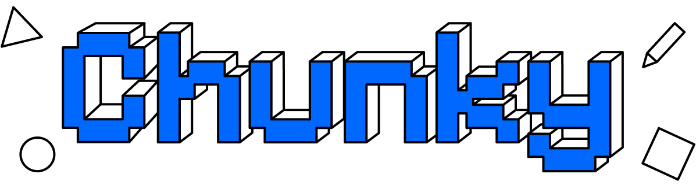

  <p align="center">
    <a href="https://chunky.studio">Chunky.studio</a>
    <span> | </span>
    <a href="https://github.com/dlgnswk/chunky">Git Repository</a>
  </p>

  <br/>


<br/>


<br/>


#

<br/>

대부분의 사람들에게 3D 모델링은 어렵습니다.
<br/>
저는 이런 3D 모델링의 진입장벽을 낮추고 싶었습니다.

<br/>

_**"만약 간단한 스케치로 3D 모델링을 할 수 있다면 어떨까?"**_<br/>
_**"스케치를 통해 3D 모델을 만들었다면 실제로 만질 수 있도록 실체화 할 수 있을까?"**_

<br/>

**_<a href="www.chunky.studio">"Chunky"</a>_** 는 사용자가 그린 스케치를 3D로 변환해주고,<br>3D 프린팅을 통해 스케치를 실제로 만들어 낼 수 있도록 도와줍니다.<br/>

### <span style="font-size: 1.5rem; font-style:italic; font-weight:bold;">간단한 스케치로 당신의 상상을 현실로 만들어보세요!</span>

<br/>

  <div align="center">
    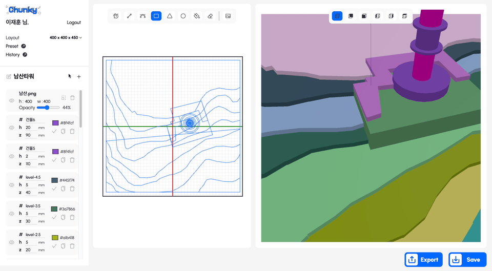
  </div>
  <div align="center">
    <span>preview</span>
    <span><a href="">(watch full video)</a></span>
  </div><br/><br/>

</div>

# 목차

<div>
  <div style="line-height: 2rem; margin-bottom: 1.5rem;">
    <a href="#main-feature" style="font-size: 1.17rem;">첫번째, 주요 기능 소개</a>
    <ul style="padding-left: 48px;">
      <li><a href="#main-feature-user">사용자 계정 추가 및 관리하기</a></li>
      <li><a href="#main-feature-drawing">그리기 도구 조작해서 그려보기</a></li>
      <li><a href="#main-feature-rendering">설정값 조절해 렌더링하기</a></li>
    </ul>
  </div>

  <div style="line-height: 2rem; margin-bottom: 1.5rem;">
    <a href="#develop-log" style="font-size: 1.17rem;">두번째, 개발 과정 기록</a>
    <ul style="padding-left: 48px;">
      <li><a href="#develop-log-draw">사용자 입력 값을 통한 선 그리기 및 저장 구현하기</a></li>
      <li><a href="#develop-log-draw-complex">다중 선과 곡선을 사용한 복잡한 도형 그리기 및 저장 구현하기</a></li>
      <li><a href="#develop-log-draw-user">그리기 도구에 사용자 경험을 고려한 기능 추가하기</a></li>
      <li><a href="#develop-log-render">완성된 스케치를 3D 모델로 렌더링하기</a></li>
      <li><a href="#develop-log-render-user">더 나은 사용자 경험을 위한 3D 렌더링 화면 구성하기</a></li>
    </ul>
  </div>

  <div style="line-height: 2rem; margin-bottom: 1.5rem;">
    <a href="#schedule" style="font-size: 1.17rem;">세번째, 전체 개발 일정</a>
    <ul style="padding-left: 48px;">
      <li><a href="#schedule-kanban">전체 일정 및 칸반</a></li>
      <li><a href="#schedule-change">일정 변동사항</a></li>
    </ul>
  </div>

  <div style="line-height: 2rem; margin-bottom: 1.5rem;">
    <a href="#memoir" style="font-size: 1.17rem;">네번째, 회고</a>
  </div>
</div>

<br/>
<br/>

# <span id="main-feature">첫번째, 주요 기능 소개</span>

## <span id="main-feature-user">사용자 계정 추가 및 관리하기</span>

### 1. 회원가입

<table width=330px;>
  <tr>
    <td>
      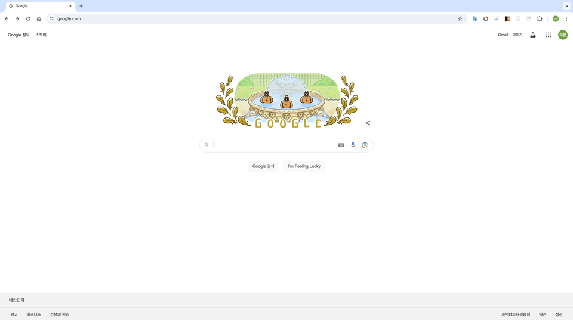
    </td>
  </tr>
</table>
<li>모든 입력필드에 대해 유효성 검사를 통과하는 경우 회원가입이 가능합니다.</li>
<li>회원가입이 완료되면 회원정보는 firebase Authentication에 저장됩니다.</li>

<br/><br/>

### 2. 로그인 및 로그아웃

<table style="width: 1000px;">
  <thead>
    <tr>
      <th style="text-align: center;">구글 로그인</th>
      <th style="text-align: center;">일반 로그인</th>
      <th style="text-align: center;">로그아웃</th>
    </tr>
  </thead>
  <tbody>
    <tr>
      <td style="text-align: center; border: 1px solid #ddd; padding: 8px;">
        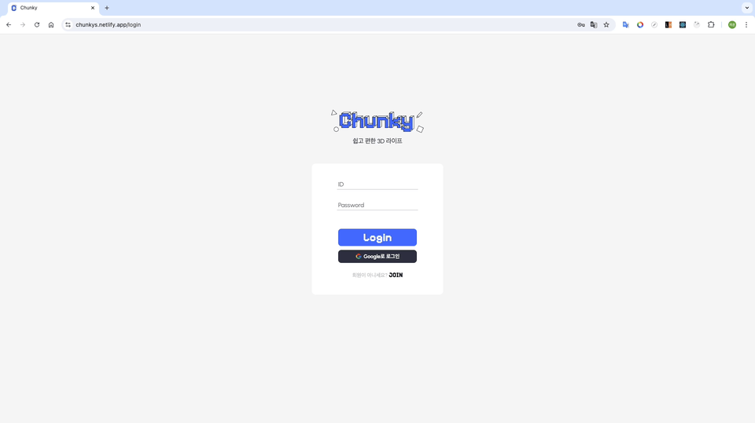
      </td>
      <td style="text-align: center; border: 1px solid #ddd; padding: 8px;">
        
      </td>
      <td style="text-align: center; border: 1px solid #ddd; padding: 8px;">
        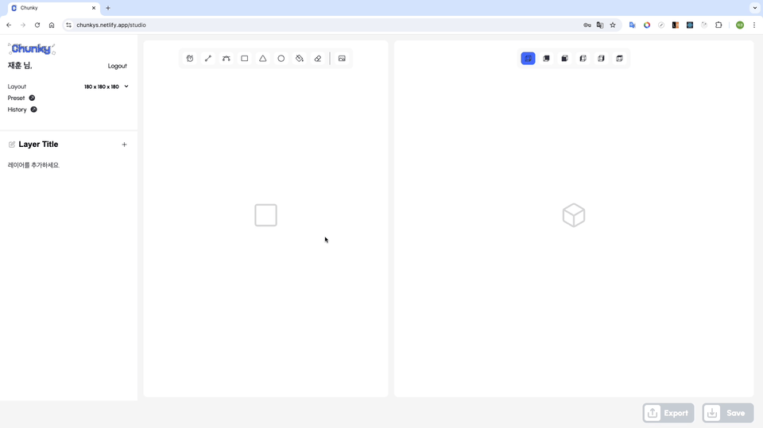
      </td>
    </tr>
  </tbody>
</table>

<li>일반 로그인 시 입력된 이메일과 비밀번호를 firebase에서 확인해 로그인합니다.</li>
<li>구글 로그인 시 로그인 되어있는 구글 계정으로 로그인합니다.</li>
<li>저장된 로그인 유저 정보를 제거합니다.</li>

<br/>

## <span id="main-feature-drawing">그리기 도구 조작해서 그려보기</span>

### 1. 스케치 기능

<table style="width: 660px;">
  <thead>
    <tr>
      <th style="text-align: center;">폴리라인 도구 (단축키 P)</th>
      <th style="text-align: center;">베지어 곡선 도구 (단축키 A)</th>
    </tr>
  </thead>
  <tbody>
    <tr>
      <td style="text-align: center; border: 1px solid #ddd; padding: 8px;">
        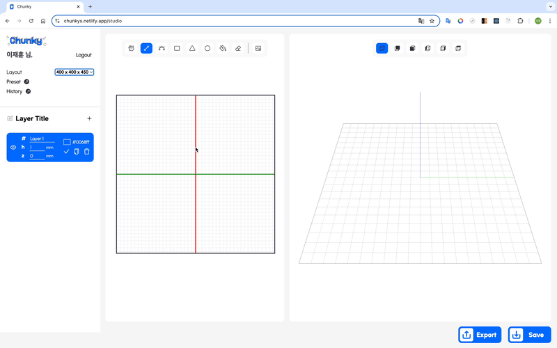
      </td>
      <td style="text-align: center; border: 1px solid #ddd; padding: 8px;">
        
      </td>
    </tr>
    <tr>
      <td style="text-align:center;">
        시작점 설정 이후 클릭 할 때마다 새로운 선을 만들고, space 입력시 선을 닫아 도형을 만들 수 있습니다.
      </td>
      <td style="text-align:center;">
        시작점 클릭하고 종료점 클릭시 원하는 굴곡 방향으로 드래그 해 곡선을 그릴 수 있습니다.
      </td>
    </tr>
  </tbody>
</table>

<br/><br/>

<table style="width: 1000px;">
  <thead>
    <tr>
      <th style="text-align: center;">사각형 도구 (단축키 R)</th>
      <th style="text-align: center;">삼각형 도구 (단축키 T)</th>
      <th style="text-align: center;">원형 도구 (단축키 C)</th>
    </tr>
  </thead>
  <tbody>
    <tr>
      <td style="text-align: center;">
        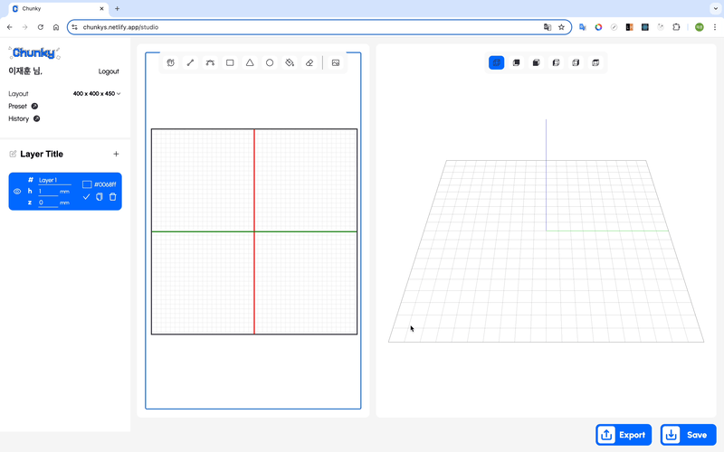
      </td>
      <td style="text-align: center;">
        
      </td>
      <td style="text-align: center;">
        
      </td>
    </tr>
    <tr>
      <td style="text-align:center;">
        시작점 클릭하고 드래그를 시작해 종료점에서 종료하여 사각형을 그릴 수 있습니다.
      </td>
      <td style="text-align:center;">
        클릭한 세 점을 꼭지점으로 하는 삼각형을 그릴 수 있습니다.
      </td>
      <td style="text-align:center;">
        클릭한 점을 중심으로 하는 원을 그릴 수 있습니다.
      </td>
    </tr>
  </tbody>
</table>

<br/><br/>

<table style="width: 1000px;">
  <tr>
    <th style="text-align: center;">페인트 도구 (단축키 P)</th>
    <th style="text-align: center;">지우개 도구 (단축키 E)</th>
    <th style="text-align: center;">이미지 가져오기 도구</th>
  </tr>
  <tr>
    <td style="text-align: center;">
      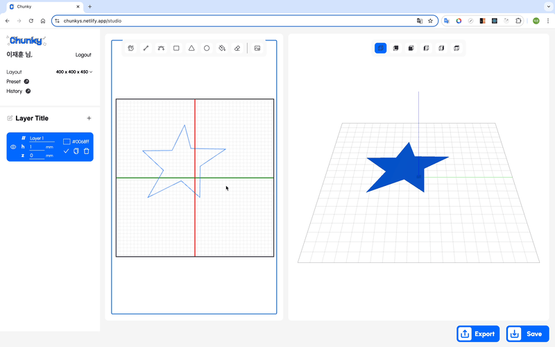
    </td>
    <td style="text-align: center;">
      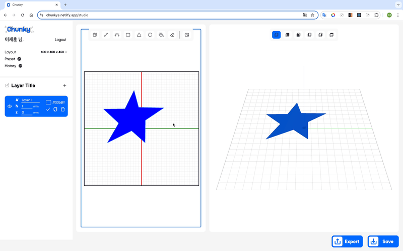
    </td>
    <td style="text-align: center;">
      
    </td>
  </tr>
  <tr>
    <td style="text-align:center;">
    레이어를 식별할 수 있도록 닫힌 스케치 내부에 색상을 채울 수 있습니다.
    </td>
    <td style="text-align:center;">
    드래그를 통해 범위내에 들어오는 도형을 삭제 합니다.
    </td>
    <td style="text-align:center;">
      이미지를 가져와 캔버스에 띄워 볼 수 있습니다.
    </td>
  </tr>
</table>

<br/><br/>

### 2. 레이어 기능

<table style="width: 1000px;">
  <tr>
    <th style="text-align: center;">레이어 생성, 복사, 삭제</th>
    <th style="text-align: center;">레이어 온오프</th>
    <th style="text-align: center;">레이어 색상 지정</th>
  </tr>
  <tr>
    <td style="text-align: center;">
      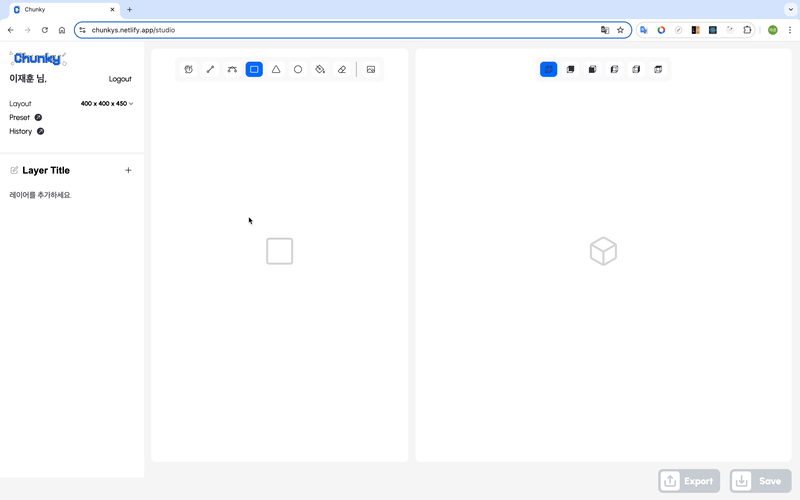
    </td>
    <td style="text-align: center;">
      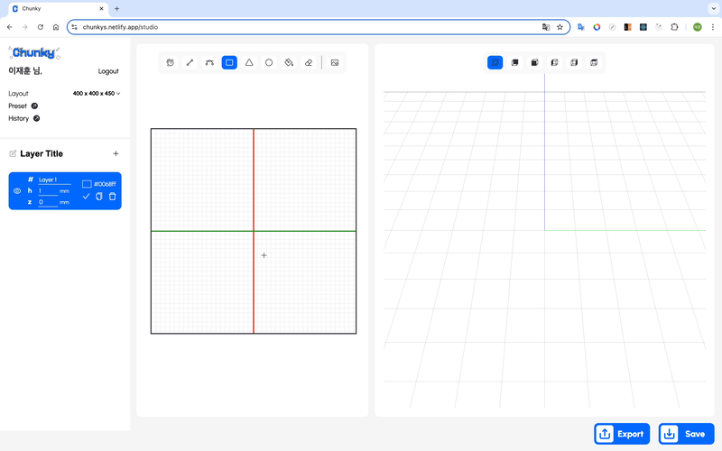
    </td>
    <td style="text-align: center;">
      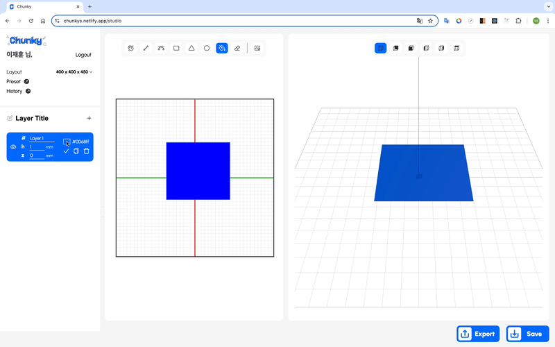
    </td>
  </tr>
  <tr>
    <td style="text-align:center;">
      레이어 버튼을 통해 생성, 복사, 삭제 기능을 사용할 수 있습니다.
    </td>
    <td style="text-align:center;">
      레이어 온오프 버튼을 통해 중첩레이어를 비교해 볼 수 있습니다.
    </td>
    <td style="text-align:center;">
      레이어의 색상을 지정해 스케치 화면에서 레이어를 더 잘 식별할 수 있습니다.
    </td>
  </tr>
</table>

<br/><br/>

## <span id="main-feature-rendering">설정값 조절해 렌더링하기</span>

### 1. 렌더링 관련 설정

<table width="330px">
  <tr>
    <th style="text-align: center;">렌더링 두께 및 높이 설정</th>
  </tr>
  <tr>
    <td>
      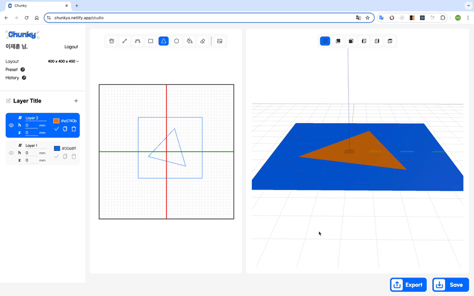
    </td>
  </tr>
  <tr>
    <td style="text-align:center;">
      그려진 스케치 레이어에 두께(h값), 시작 높이(z값)을 설정하여 렌더링 속성을 지정할 수 있습니다.
    </td>
  </tr>
</table>

<br/><br/>

### 2. 카메라 관련 설정

<table style="width: 660px;">
  <tr>
    <th style="text-align: center;">렌더링 시점 변경</th>
    <th style="text-align: center;">렌더링 카메라 변경</th>
  </tr>
  <tr>
    <td style="text-align: center;">
      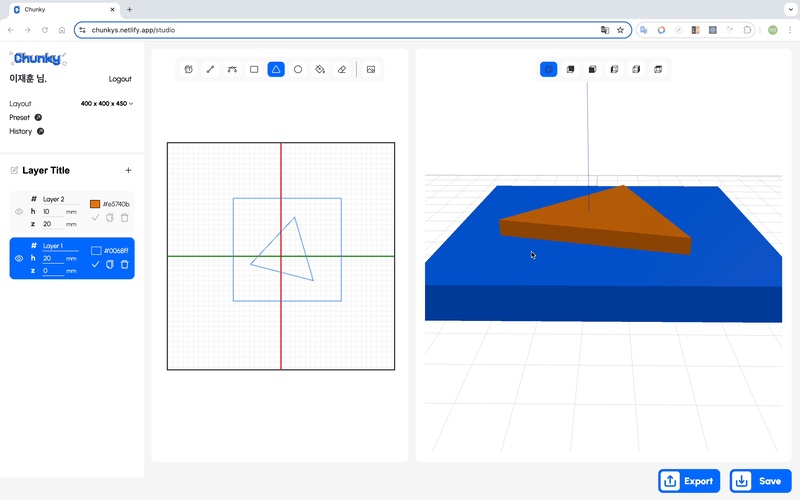
    </td>
    <td style="text-align: center;">
      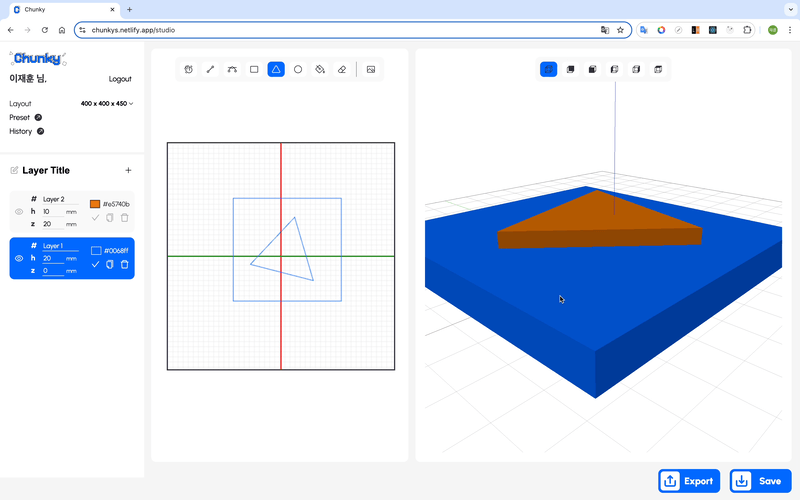
    </td>
  </tr>
  <tr>
    <td style="text-align:center;">
      생성된 모델을 확대 및 축소, 회전하여 시점을 변경할 수 있습니다.
    </td>
    <td style="text-align:center;">
      설정된 카메라 옵션을 클릭해 카메라를 변경할 수 있습니다.
    </td>
  </tr>
</table>

<br/><br/>

# <span id="develop-log">두번째, 개발 과정 기록</span>

## <span id="develop-log-draw">사용자 입력 값을 통한 선 그리기 및 저장 구현하기</span>

사용자가 그린 선을 통해 3D 렌더링을 하려면 단순히 선 형태의 이미지가 아니라 선 자체가 값을 가져야 했습니다.
특히 직선뿐만 아니라 곡선, 다각형 등 다양한 형태의 도형도 그릴 수 있어야 했기 때문에 몇가지 조건이 있었습니다.

- 확대, 축소 시 픽셀이 깨지는 등의 품질 저하 없이 선명한 도형을 유지해야합니다.
- 그리기 도구를 이용한 다양한 형태의 스케치를 일관된 방식으로 처리해야 합니다.
- 사용자가 그린 2D 스케치를 3D 렌더링으로 변환할 수 있는 데이터로 저장해야 합니다.

먼저, 가장 기본적인 요구사항 부터 해결해보려고 했습니다.

<br/>

### 1. 품질 저하가 일어나지 않는 그래픽 형식은 무엇이 있을까?

**1) SVG:**
<br/>

- 벡터기반 그래픽 포맷으로 수학적으로 이미지를 정의합니다.
- 확대, 축소 시 품질 저하가 없고 파일 크기가 작습니다.
- XML 기반으로 편집이 가능하고, 웹표준을 따릅니다.

**2) PNG:**
<br/>

- 래스터 그래픽 포맷입니다.
- 투명도를 지원합니다.
- 확대, 축소시 품질 저하가 발생할 수 있습니다.

**3) EPS:**
<br/>

- 벡터, 래스터 이미지를 모두 포함하는 그래픽 포맷입니다.
- 다양한 디자인 요소를 사용할 수 있습니다.
- 웹 브라우저에서 직접 지원하지 않습니다.

<br/>

> [!NOTE]
> 조사 결과를 토대로 1. **웹표준을 지원**하고 2. **품질 저하**가 없으며 3. **수정이 가능**한 SVG 그래픽 포맷을 적용하고자 했습니다.

<br/>

### 2. 사용자가 그리는 다양한 도형들을 어떻게 효과적이고 일관된 방식으로 저장할 수 있을까?

처음에는 단순히 자유선형으로 그리는 방식을 생각했었지만 그렇게 되면 SVG 그래픽 포맷의 이점을 잃는다는 생각이 들었습니다.
SVG는 다양한 속성을 지원하는데, 현재 필요한 기능에는 모든 속성이 필요하지는 않았습니다.

예를 들면, 각 그리기 도구에 필요한 SVG 속성들을 분석해본 결과는 다음과 같습니다.

- 폴리라인 도구: `points`, `closePath()`
- 베지어 곡선 도구: `moveTo()`, `quadraticCurveTo()`
- 사각형 도구: `x`, `y`, `width`, `height`
- 삼각형 도구: `points`
- 원 도구: `cx`, `cy`, `r`
- 공통: `stroke`, `stroke-width`, `fill`

<br/>

SVG의 모든 속성들이 그리기 도구 로직에 필요하지 않기 때문에 JavaScript 객체로 SVG와 유사한 구조를 만들기로 결정했습니다.

> [!NOTE]
> 이러한 방식을 채택한 이유는 다음과 같습니다.
>
> 1. 필요한 속성만 정의하여 데이터를 가볍게 유지할 수 있었습니다.
> 2. 3D 렌더링에 필요한 추가 속성들을 쉽게 추가할 수 있었습니다.
> 3. JavaScript 객체로 작성되어 데이터 조작 및 관리가 더 용이했습니다.
>
> 이러한 방식으로 사용자가 그린 스케치를 벡터 그래픽 포맷으로 저장하면서, 필요한 다른 속성들도 쉽게 추가할 수 있게 되었습니다.

<br/>

### 3. 그린 도형을 좌표값으로 어떻게 저장해야 할까?

사용자의 편의성을 위해 여러 종류의 그리기 도구를 추가해야했습니다.
<br/>
그리기 도구들에 대해 조사를 하다보니 만들어질 도형마다 필요한 속성들이 조금씩 달랐고 일관된 데이터 관리를 위해 구조를 정리해야 했습니다.

먼저 필요한 속성들을 전부 정리해 공통 속성과, 개별속성으로 구분했습니다.

**1) 공통 속성**

```javascript
{
  id: String,          // 고유한 값(uuid)
  index: Number,       // 레이어 인덱스
  name: String,        // 레이어 이름
  path: Array,         // 도형의 좌표값
  fill: String,        // 도형의 채우기 색상
  visible: Boolean,    // 도형의 표시 여부
  type: "draw",        // 기본값은 "draw", 이미지 레이어의 경우 "image"
  height: Number,      // 렌더링 시 해당 레이어의 두께
  zIndex: Number       // 렌더링 시 해당 레이어의 시작 높이
}
```

<br/>
<br/>

**2) 개별 속성**

- 폴리라인

  ```javascript
  {
    // 공통 속성...
    path: [
      {
        type: 'polyline',
        closed: Boolean, // 폴리라인 닫힘 여부
        fill: String, // 채우기 색상
        points: [
          // 폴리라인을 구성하는 점들의 x, y 좌표 배열
          { x: Number, y: Number },
          // 추가 점들...
        ],
      },
    ];
  }
  ```

<br/>

- <span id="bezier-curve">베지어 곡선</span>

  ```javascript
  {
    // 공통 속성...
    path: [
      {
        type: 'closedBezier',
        fill: String, // 채우기 색상
        curves: [
          {
            // 베지어 곡선 세그먼트들의 배열
            type: 'bezier',
            cx: Number, // 제어점 x 좌표
            cy: Number, // 제어점 y 좌표
            x1: Number, // 시작점 x 좌표
            x2: Number, // 끝점 x 좌표
            y1: Number, // 시작점 y 좌표
            y2: Number, // 끝점 y 좌표
          },
          {
            // 곡선을 닫는 직선의 배열
            type: 'line',
            x1: Number, // 시작점 x 좌표
            x2: Number, // 끝점 x 좌표
            y1: Number, // 시작점 y 좌표
            y2: Number, // 끝점 y 좌표
          },
        ],
      },
    ];
  }
  ```

<br/>

- 사각형
  ```javascript
  {
    // 공통 속성...
    path: [
      {
        type: 'rectangle',
        fill: String, // 채우기 색상
        height: Number, // 사각형의 높이 (y축 길이)
        width: Number, // 사각형의 너비 (x축 길이)
        x: Number, // 좌상단 모서리의 x 좌표
        y: Number, // 좌상단 모서리의 y 좌표
      },
    ];
  }
  ```

<br/>

- 삼각형
  ```javascript
  {
    // 공통 속성...
    path: [
      {
        type: "triangle"
        fill: String,    // 채우기 색상
        points: [        // 삼각형의 세 꼭지점의 x, y 좌표
          { x: Number, y: Number },
          { x: Number, y: Number },
          { x: Number, y: Number }
        ],
      }
    ]
  }
  ```

<br/>

- 원형

  ```javascript
  {
    // 공통 속성...
    path: [
      {
        type: 'circle',
        fill: String, // 채우기 색상
        center: {
          // 원의 중심점의 x, y 좌표
          x: Number,
          y: Number,
        },
        radius: Number, // 원의 반지름
      },
    ];
  }
  ```

  <br/>

> [!NOTE]
> 이런 방식으로 그려진 도형을 저장하는 구조를 일관성, 확장성을 고려해 정리했습니다.
>
> 공통 속성을 통해 데이터 관리의 일관성을 확보하였고, 개별 속성을 통해 다양한 도형을 정확히 표현할 수 있도록 했습니다.

<br/>
<br/>

## <span id="develop-log-draw-complex">다중 선과 곡선을 사용한 복잡한 도형 그리기 및 저장 구현하기</span>

x, y 좌표값로 이루어져있는 비교적으로 단순한 도형을 제외하고 폴리라인과 베지어 곡선은<br/>
로직을 작성하는데 많은 어려움이 있었습니다.
<br/><br/>
먼저 폴리라인을 작성하는 로직을 살펴보겠습니다.

<br/>

### 1. 여러 직선을 이어 그리는 폴리라인 도구

<div align="center">
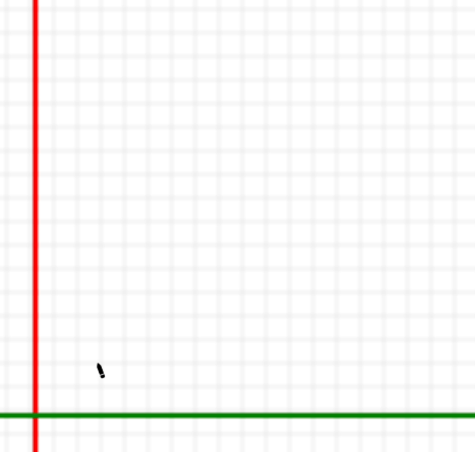

<span align="right" style="color: gray">폴리라인 그리기 도구</span>

</div>

폴리라인은 원하는 지점을 계속 클릭해 선을 그릴 수 있게 하는 도구입니다.
<br/>
사용자의 클릭으로 계속 새로운 선을 그려나가기 때문에 시작, 진행, 종료 단계를 정확히 구분하는 것이 중요했습니다.
<br/>
이를 위해 키보드 이벤트도 추가해 그리기 완료, 취소 기능을 구현하였습니다.

이러한 목적으로 구현한 폴리라인 그리기 로직의 순서를 이벤트 기준으로 도식화하면 다음과 같습니다.

<br>

#### 1-1. `mousedown` 이벤트

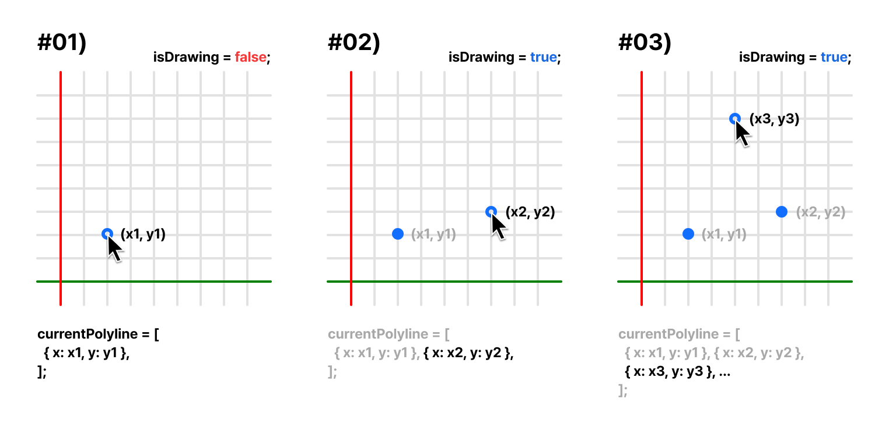

**#01)**
<br/>1. `getMousePosition` 메소드를 통해 클릭한 위치의 좌표를 계산합니다.
<br/>2. 그리는 상태를 판별하는 `isDrawing` 변수를 `true`로 설정합니다. (기본값은 `false`)
<br/>3. 전역 상태의 변수인 `currentPolyline` 배열에 해당 좌표를 추가합니다.

**#02)**
<br/>4. `isDrawing` 변수를 확인합니다. 6. `true`인 경우 즉, 이미 그리기 중인 경우 새로운 점을 `currentPolyline` 배열에 추가합니다.

**#03)**
<br/>5. `keydown` 이벤트가 발생하기 전까지 상기 과정을 반복합니다.

<br/>

#### 1-2. `keydown` 이벤트 - `Space` 또는 `Enter`

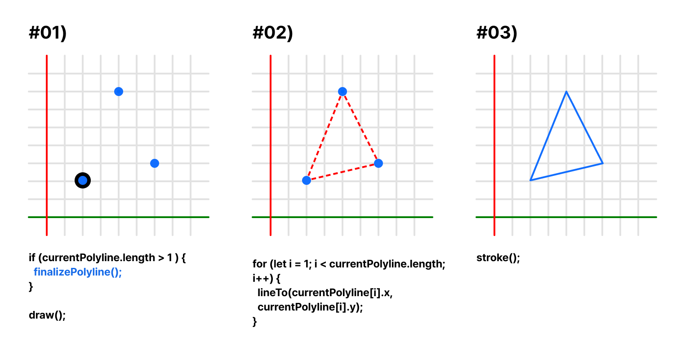

**#01)**
<br/>1. 먼저 `currentPolyline` 변수를 확인해 추가된 점이 2개 이상인지 판별합니다.
<br/>2. 2개 이상인 경우 `draw` 메소드를 호출합니다. (1개 이하인 경우 아무 작업도 수행하지 않음)
<br/>3. `draw` 메소드는 canvas API의 기본 기능을 조합해 만든 메소드 입니다.
<br/>4. `clearRect()` 메소드로 캔버스를 정리합니다.
<br/>5. `moveTo()` 메소드로 `currentPolyline`의 첫번째 점(폴리라인의 시작점)으로 이동합니다.

**#02)**
<br/>6. `for()` 반복문을 통해 나머지 점들을 순회하며 `lineTo()` 메소드로 가상의 선을 그립니다.

**#03)**
<br/>7. `stroke()` 메소드로 가상의 선을 실제 선으로 변환해 캔버스에 그립니다.

<br/>

#### 1-3. `keydown` 이벤트 - `Escape`

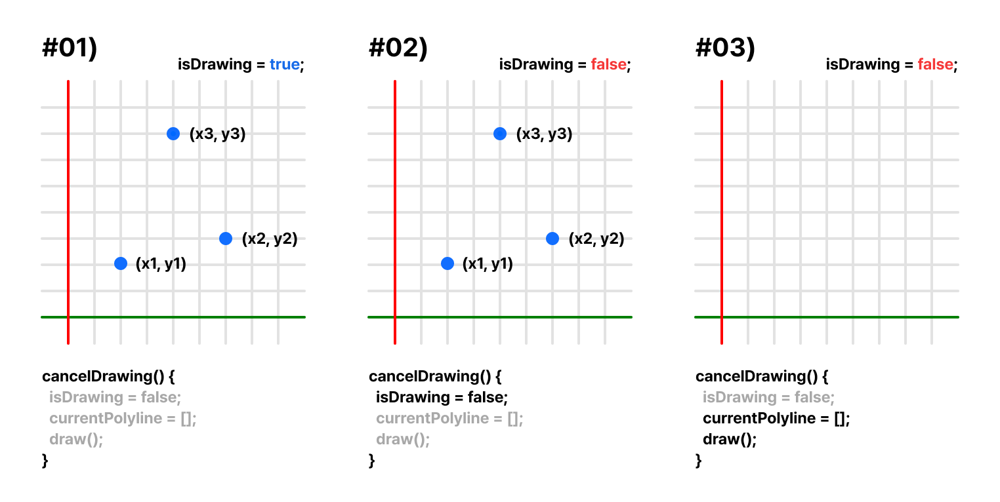

**#01)**
<br/>1. 먼저 `cancelDrawing()` 메소드를 호출합니다.

**#02)**
<br/>2. 그리기 상태를 나타내는 `isDrawing` 변수를 `false` 초기화합니다.

**#03)**
<br/>3. 폴리라인의 데이터들을 나타내는 `currentPolyline` 배열에서 데이터를 삭제합니다.
<br/>4. `draw()` 메소드를 호출해 `clearRect() 메소드로 캔버스를 정리합니다.

<br/><br/>

### 2. 세개의 조절점을 통해 그린 3점 베지어 곡선 도구

<br/>

<div align="center">
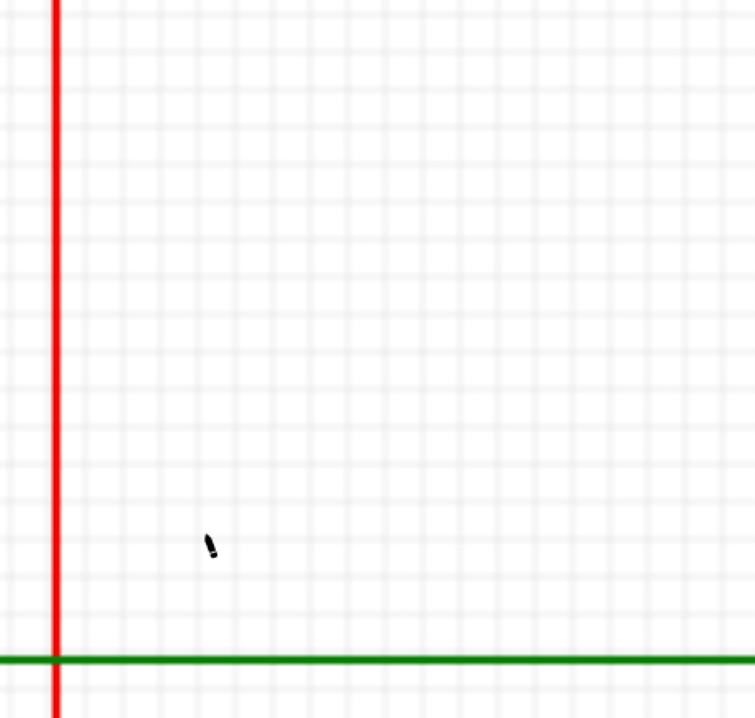

<span align="right" style="color: gray">베지어 곡선 그리기 도구</span>

</div>

베지어 곡선은 조절점을 사용해 곡선을 그릴 수 있는 도구입니다.

베지어 곡선은 조절점의 개수에 따라 n차 베지어 곡선이 존재합니다.
<br/>
그 중 1개의 조절점을 사용하는 2차 베지어 곡선을 사용한 이유는 다음과 같습니다.

- 1개의 조절점으로도 곡선을 쉽게 그릴 수 있어, 간단한 인터페이스를 구현하고자 하는 목표에 부합했습니다.
- 여러개의 2차 베지어 곡선을 연결해 복잡한 형태 또한 표현 가능합니다.
- 구현이 상대적으로 간단하기 때문에 길지 않은 개발기간에 적합했습니다.

<br/>

이러한 목적으로 구현한 베지어 곡선 그리기 로직의 순서를 이벤트 기준으로 도식화하면 다음과 같습니다.

<br/>

#### 2-1. `mousedown` 이벤트

  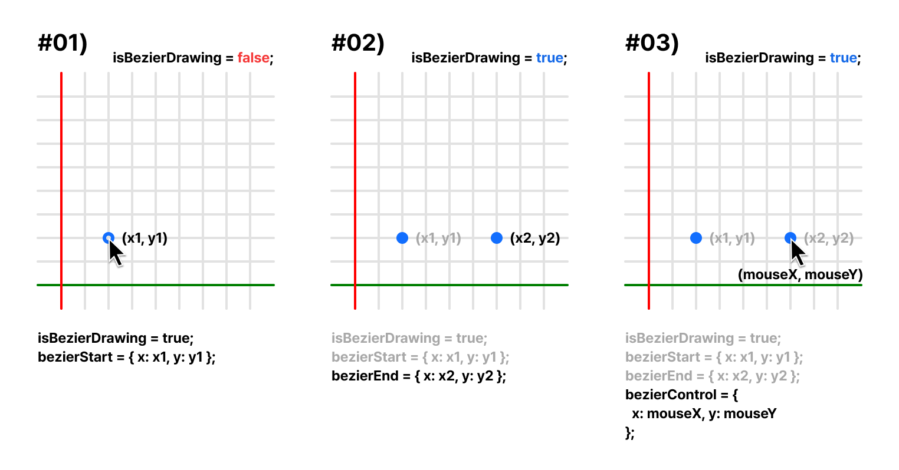

**#01)**
<br/>1. `mousedown` 이벤트 발생 시 `handleMouseDown` 메소드를 호출합니다.
<br/>2. 그리는 상태를 판별하는 `isBezierDrawing` 변수를 `true`로 설정합니다. (기본값은 `false`)
<br/>3. `bezierStart` 를 현재 마우스 위치 좌표로 설정합니다.

**#02)**
<br/>4. 두번째 클릭시 `bezierEnd` 를 현재 마우스 위치 좌표로 설정합니다.

**#03)**
<br/>5. `bezierControl` 을 현재 마우스 위치로 초기화합니다.

<br/>

#### 2-2. `mousemove` 이벤트

  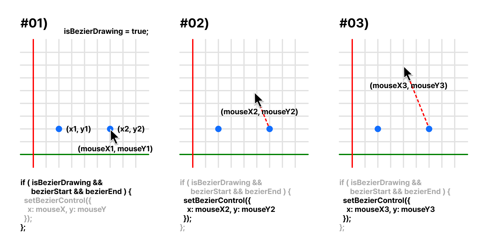

**#01)**
<br/>1. `isBezierDrawing` 변수가 `true`이고 `bezierStart`, `bezierEnd` 가 설정되었는지 확인합니다.

**#02)**
<br/>2. 모든 조건이 참인 경우 `bezierControl` 을 변경된 마우스 위치로 업데이트 합니다.

**#03)**
<br/>3. 마우스 위치를 계속 추적하며 `bezierControl` 을 계속 업데이트 합니다.

<br/>

#### 2-3. `mouseup` 이벤트

  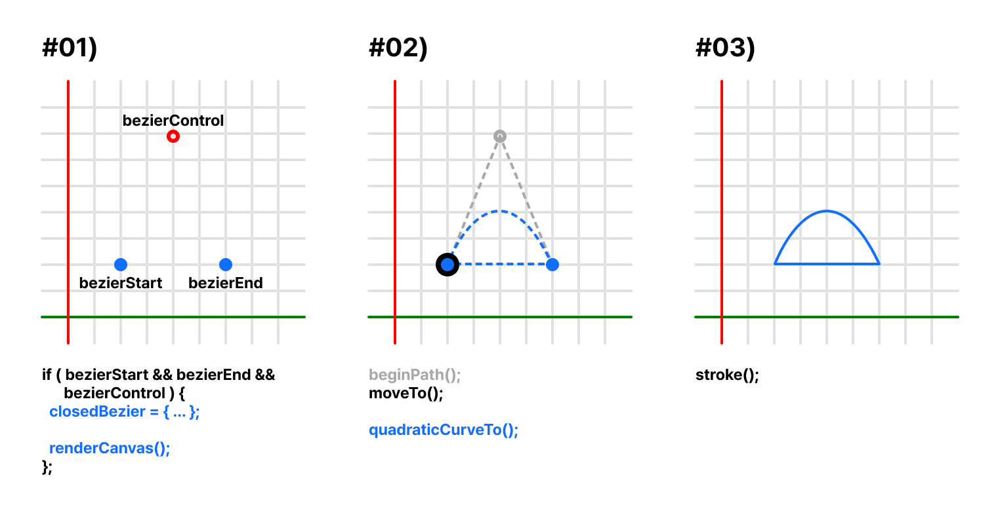

**#01)**
<br/>1. `bezierStart`, `bezierEnd`, `bezierControl` 이 전부 설정되었는지 확인합니다.
<br/>2. 경로를 담을 수 있는 `closedBezier` 객체를 생성합니다.
<br/>3. 이 객체의 형태가 <a href="#bezier-curve">베지어 곡선의 개별 속성</a>으로 정의됩니다.
<br/>4. 이 객체에 `bezierStart`, `bezierEnd`, `bezierControl`의 값을 업데이트 합니다.
<br/>5. `renderCanvas()` 메소드를 호출합니다.

**#02)**
<br/>6. `beginPath()` 메소드로 선그리기를 시작합니다.
<br/>7. 반복문을 통해 `curve` 배열을 순회합니다.
<br/>8. 첫번째 경로를 확인해 `moveTo` 메소드로 해당 점(시작점)으로 이동합니다.
<br/>9. `quadraticCurveTo()`메소드로 제어점, 끝점값을 통해 가상의 곡선을 그립니다.
<br/>10. `lineTo()` 메소드로 시작점과 끝점을 이어 닫는 가상의 직선을 그립니다.

**#03)**
<br/>11. `stroke()` 메소드로 실제 캔버스에 곡선을 그립니다.

<br/>
<br/>

## <span id="develop-log-draw-user">그리기 도구에 사용자 경험을 고려한 기능 추가하기</span>

### 1. 그려진 도형의 모서리를 표시해주는 스냅포인트

스냅 포인트는 도형의 특정 모서리를 정확히 접근가능하게 도와주는 도구입니다.
<br/>
사용자가 기존 도형에 이어서 새로운 도형을 그릴 경우 정확한 점을 추적할 수 있게 도와줍니다.
<br/><br/>
마우스 이벤트를 통해 구현한 스냅 포인트 로직의 순서를 이벤트 기준으로 도식화하면 다음과 같습니다.

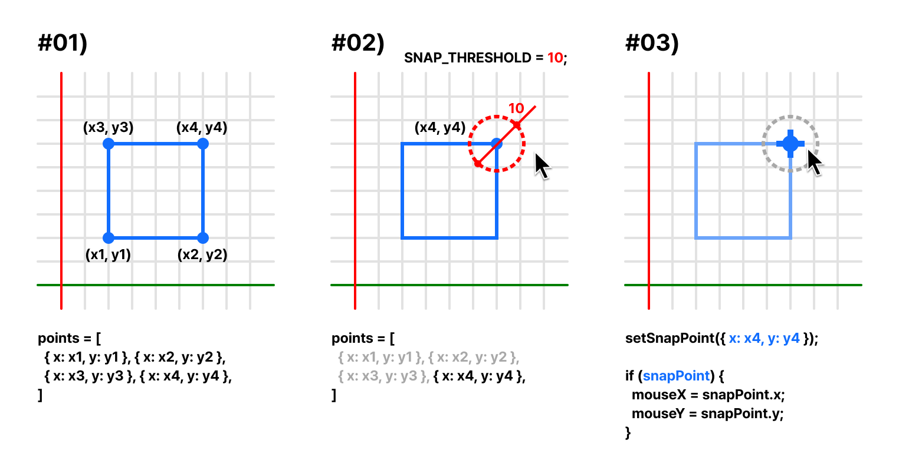

<br/>

**#01)**
<br/>1. `mousemove` 이벤트를 통해 마우스가 움직일때마다 그려진 도형의 점들을 확인합니다.

**#02)**
<br/>2. 해당 점과 마우스의 좌표를 계산해 거리가 설정된 `SNAP_THRESHOLD`의 값보다 작은지 확인합니다.

**#03)**
<br/>3. `SNAP_THRESHOLD`의 값보다 작은 경우 스냅포인트를 표시합니다.

<br/>

### 2. 그려질 선을 미리볼 수 있는 예상 그리기 선 표시

예상 그리기 선 표시를 통해 사용자는 그려질 선을 확인하며 작업할 수 있습니다.
<br/>
이를 위해 마우스 이벤트를 통해 구현한 예상 그리기 선 표시 로직을 이벤트 기준으로 도식화하면 다음과 같습니다.

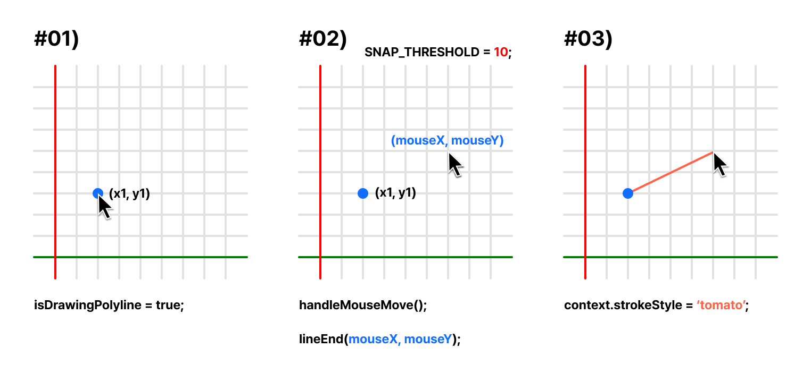

<br/>

**#01)**
<br/>1. 어떤 도구를 통해 그리고 있는지 확인합니다.

**#02)**
<br/>2. `mousemove` 이벤트를 통해 마우스의 위치를 계속 확인합니다.

**#03)**
<br/>3. `context` 를 통해 선을 그리고 스타일을 부여합니다.

<br/>

### 3. 도형 내부의 색을 채우는 페인트 도구

레이어가 중첩되어있는 경우 페인트 도구를 통해 쉽게 식별할 수 있습니다.<br/>
마우스 이벤트를 통해 구현한 페인트 도구를 이벤트 기준으로 도식화 하면 다음과 같습니다.

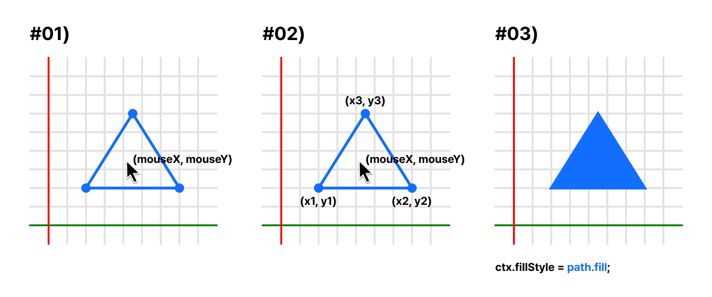

<br/>

**#01)**
<br/>1. `mousedown` 이벤트가 발생한 시점의 마우스 좌표를 확인합니다.

**#02)**
<br/>2. 선택된 레이어에 존재하는 모든 도형을 순회해 좌표들을 확인합니다.
<br/>3. 마우스 좌표와 도형의 좌표를 통해 내부를 클릭했는지 판단합니다.

**#03)**
<br/>4. 내부가 클릭되었다면 `context`를 통해 `fill` 속성을 업데이트 합니다.

<br/>

## <span id="develop-log-render">완성된 스케치를 3D 모델로 렌더링하기</span>

### 저장된 2D 스케치의 좌표를 가져와 3D 모델링 및 렌더링

스케치를 하고 있는 2D 캔버스의 좌표를 가져와 3D 캔버스의 좌표에 렌더링합니다.<br/>
이 과정을 도식화 하면 다음과 같습니다.

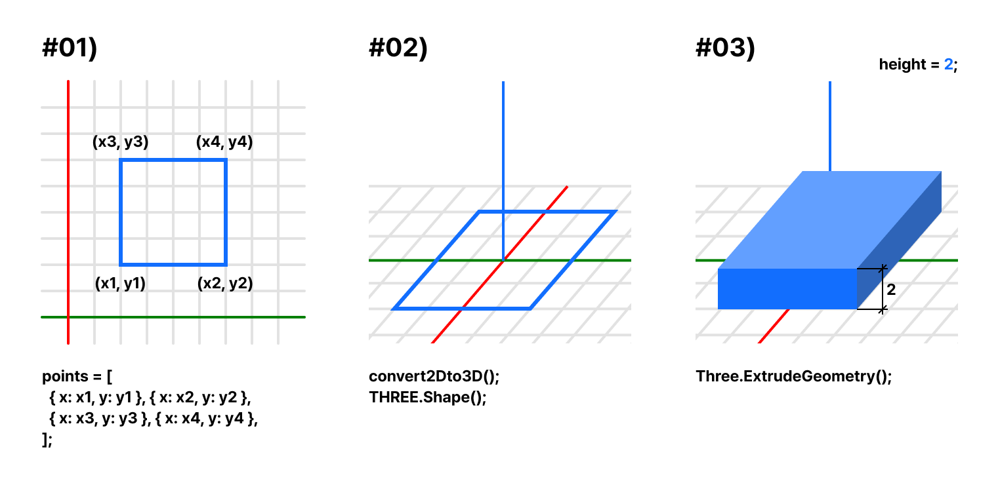

<br/>

**#01)**
<br/>1. 그려진 2D 스케치의 좌표값을 확인합니다.

**#02)**
<br/>2. 2D 좌표값을 3D 캔버스의 중심을 기준으로 변경합니다.
<br/>3. `Three.js`의 `Shape()` 메소드를 통해 도형을 생성합니다.

**#03)**
<br/>4. 가져온 높이값으로 `Three.js`의 `(ExtrudeGeometry())` 메소드를 통해 모델링과 렌더링을 진행합니다.

<br/>

## <span id="develop-log-render-user">더 나은 사용자 경험을 위한 3D 렌더링 화면 구성하기</span>

### 1. 3D 공간을 확인하기 위한 그리드와 3D 축

사용자가 작업을 하다보면 지금 보는 화면이 어떤 방향인지 인식하기 어려울 때가 있습니다.<br/>
이러한 기능을 제공해 공간감각을 제공하고, 거리와 크기 그리고 방향을 인식하기 쉽게 만듭니다.<br/><br/>
이 기능을 구현하기 위해 작성한 순서는 다음과 같습니다.

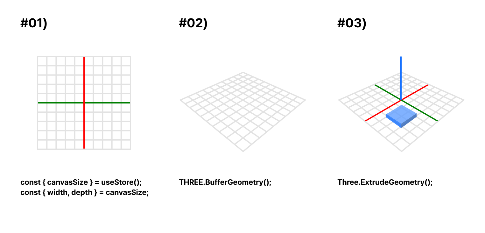

**#01)**
<br/>1. 2D 캔버스의 레이아웃 크기를 가져옵니다.

**#02)**
<br/>2. 크기를 20개로 분할하여 그리드를 렌더링합니다.

**#03)**
<br/>3. 렌더링한 그리드 위에 세개의 축을 추가해 가시성을 확보할 수 있게 하였습니

<br/>

### 2. 작업 편의를 위한 카메라 세팅

사용자가 작업할 때 미리 설정된 다양한 뷰를 통해 디테일한 부분이나 전체적인 형태를 확인 할 수 있습니다.<br/>
설정된 뷰는 다음과 같이 구분됩니다.

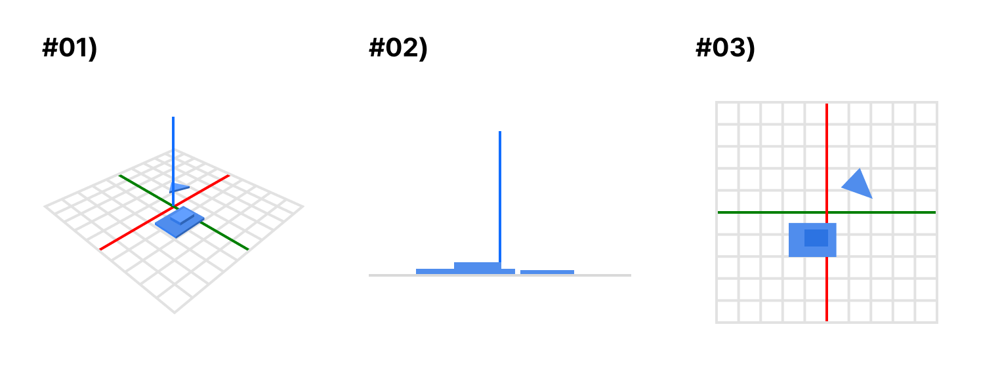

<br/>

**#01)**
<br/>1. 원근뷰로 기본 카메라 설정입니다. 3D를 가장 자연스럽게 보여주며 전체 형태를 관찰하기 용이합니다.

**#02)**
<br/>2. 평면뷰로 정면, 후면, 좌측, 우측뷰가 있습니다. 2D 평면처럼 보이게 설정해 디테일한 부분을 확인할 수 있습니다.

**#03)**
<br/>3. 배치뷰로 전체 모델의 배치를 확인할 수 있습니다.

<br/>
<br/>

# <span id="schedule">세번째, 전체 개발 일정</span>

## <span id="schedule-kanban">전체 일정 및 칸반</span>

> 프로젝트 기간: 2024.07.14 ~ 2024.07.31 (약 3주)

### 1주차: 기획 및 프로젝트 세팅

<table style="width: 100%;">
  <thead>
    <tr>
      <th style="text-align: center;" colspan="7" >1주차</th>
    </tr>
    <tr>
      <th style="text-align: center;">07/14 (일)</th>
      <th style="text-align: center;">07/15 (월)</th>
      <th style="text-align: center;">07/16 (화)</th>
      <th style="text-align: center;">07/17 (수)</th>
      <th style="text-align: center;">07/18 (목)</th>
      <th style="text-align: center;">07/19 (금)</th>
      <th style="text-align: center;">07/20 (토)</th>
    </tr>
  </thead>
  <tbody>
    <tr>
      <td style="text-align: center; border: 1px solid #ddd; padding: 8px;">
        회원가입, 로그인
      </td>
      <td style="text-align: center; border: 1px solid #ddd; padding: 8px;">
        회원가입 완료
      </td>
      <td style="text-align: center; border: 1px solid #ddd; padding: 8px;">
        드로잉 페이지 UI
      </td>
      <td style="text-align: center; border: 1px solid #ddd; padding: 8px;">
        모달 UI
      </td>
      <td style="text-align: center; border: 1px solid #ddd; padding: 8px;">
        그리기 툴 - 사각형
      </td>
      <td style="text-align: center; border: 1px solid #ddd; padding: 8px;">
        그리기 툴 - 삼각형
      </td>
      <td style="text-align: center; border: 1px solid #ddd; padding: 8px;">
        그리기 툴 - 사각형
      </td>
    </tr>
  </tbody>
</table>

### 2주차: 정적 UI 구현 및 2D 관련 기능 개발

<table style="width: 100%;">
  <thead>
    <tr>
      <th style="text-align: center;" colspan="7" >2주차</th>
    </tr>
    <tr>
      <th style="text-align: center;">07/21 (일)</th>
      <th style="text-align: center;">07/22 (월)</th>
      <th style="text-align: center;">07/23 (화)</th>
      <th style="text-align: center;">07/24 (수)</th>
      <th style="text-align: center;">07/25 (목)</th>
      <th style="text-align: center;">07/26 (금)</th>
      <th style="text-align: center;">07/27 (토)</th>
    </tr>
  </thead>
  <tbody>
    <tr>
      <td style="text-align: center; border: 1px solid #ddd; padding: 8px;">
        그리기 툴 -  폴리라인
      </td>
      <td style="text-align: center; border: 1px solid #ddd; padding: 8px;">
        그리기 툴 -  베지어 곡선
      </td>
      <td style="text-align: center; border: 1px solid #ddd; padding: 8px;">
        그리기 툴 -  페인트
      </td>
      <td style="text-align: center; border: 1px solid #ddd; padding: 8px;">
        그리기 툴 -  지우개
      </td>
      <td style="text-align: center; border: 1px solid #ddd; padding: 8px;">
        3D 렌더링 구현
      </td>
      <td style="text-align: center; border: 1px solid #ddd; padding: 8px;">
        렌더링 높이 추가 구현
      </td>
      <td style="text-align: center; border: 1px solid #ddd; padding: 8px;">
        렌더링 카메라 세팅
      </td>
    </tr>
  </tbody>
</table>

### 3주차: 3D 관련 기능 개발

<table style="width: 100%;">
  <thead>
    <tr>
      <th style="text-align: center;" colspan="7" >3주차</th>
    </tr>
    <tr>
      <th style="text-align: center;">07/28 (일)</th>
      <th style="text-align: center;">07/29 (월)</th>
      <th style="text-align: center;">07/30 (화)</th>
      <th style="text-align: center;">07/31 (수)</th>
      <th style="text-align: center;">08/01 (목)</th>
      <th style="text-align: center;">08/02 (금)</th>
      <th style="text-align: center;">08/03 (토)</th>
    </tr>
  </thead>
  <tbody>
    <tr>
      <td style="text-align: center; border: 1px solid #ddd; padding: 8px;">
        .stl 파일 저장
      </td>
      <td style="text-align: center; border: 1px solid #ddd; padding: 8px;">
        프리셋 작성
      </td>
      <td style="text-align: center; border: 1px solid #ddd; padding: 8px;">
        리팩토링
      </td>
      <td style="text-align: center; border: 1px solid #ddd; padding: 8px;">
      </td>
      <td style="text-align: center; border: 1px solid #ddd; padding: 8px;">
      </td>
      <td style="text-align: center; border: 1px solid #ddd; padding: 8px;">
      </td>
      <td style="text-align: center; border: 1px solid #ddd; padding: 8px;">
      </td>
    </tr>
  </tbody>
</table>

<br/>
<br/>

## <span id="schedule-change">일정 변동사항</span>

<br/><br/>

# <span id="memoir">네번째, 회고</span>
