<div align="center">
  

  <p align="center">
    <a href="https://chunky.site">Chunky Website</a>
    <span> | </span>
    <a href="https://github.com/dlgnswk/chunky">Git Repository</a>
  </p>

  <br/>


<br/>


<br/>


#

<br/>

대부분의 사람들에게 3D 모델링은 어렵습니다.
<br/>
저는 이런 3D 모델링의 진입장벽을 낮추고 싶었습니다.

<br/>

_**"만약 간단한 스케치로 3D 모델링을 할 수 있다면 어떨까?"**_<br/>
_**"스케치를 통해 3D 모델을 만들었다면 실제로 만질 수 있도록 실체화 할 수 있을까?"**_

<br/>

**_<a href="www.chunky.studio">"Chunky"</a>_** 는 사용자가 그린 스케치를 3D로 변환해주고,<br>3D 프린팅을 통해 스케치를 실제로 만들어 낼 수 있도록 도와줍니다.<br/>

### <span style="font-size: 1.5rem; font-style:italic; font-weight:bold;">간단한 스케치로 당신의 상상을 현실로 만들어보세요!</span>

<br/>

  <div align="center">
    
  </div>
  <div align="center">
    <span>preview</span>
    <span><a href="">(watch full video)</a></span>
  </div><br/><br/>

</div>

# 목차

<div>
  <div style="line-height: 2rem; margin-bottom: 1.5rem;">
    <a href="#controls" style="font-size: 1.17rem;">첫번째, 조작 방법</a>
  </div>

  <br/>
  
  <div style="line-height: 2rem; margin-bottom: 1.5rem;">
    <a href="#main-feature" style="font-size: 1.17rem;">두번째, 주요 기능 소개</a>
    <ul style="padding-left: 48px;">
      <li><a href="#main-feature-drawing">그리기 도구 조작해서 그려보기</a></li>
      <li><a href="#main-feature-rendering">설정값 조절해 렌더링하기</a></li>
      <li><a href="#main-feature-user">사용자 계정 추가 및 관리하기</a></li>
    </ul>
  </div>

  <div style="line-height: 2rem; margin-bottom: 1.5rem;">
    <a href="#develop-log" style="font-size: 1.17rem;">세번째, 개발 과정 기록</a>
    <ul style="padding-left: 48px;">
      <li><a href="#develop-log-draw">사용자 입력 값을 통한 선 그리기 및 저장 구현하기</a></li>
      <li><a href="#develop-log-draw-complex">다중 선과 곡선을 사용한 복잡한 도형 그리기 및 저장 구현하기</a></li>
      <li><a href="#develop-log-draw-user">그리기 도구에 사용자 경험을 고려한 기능 추가하기</a></li>
      <li><a href="#develop-log-render">완성된 스케치를 3D 모델로 렌더링하기</a></li>
      <li><a href="#develop-log-render-user">더 나은 사용자 경험을 위한 3D 렌더링 화면 구성하기</a></li>
    </ul>
  </div>

  <div style="line-height: 2rem; margin-bottom: 1.5rem;">
    <a href="#schedule" style="font-size: 1.17rem;">네번째, 전체 개발 일정</a>
  </div>

  <br/>

  <div style="line-height: 2rem; margin-bottom: 1.5rem;">
    <a href="#memoir" style="font-size: 1.17rem;">다섯번째, 회고</a>
  </div>
</div>

<br/>
<br/>

# <span id="controls">첫번째, 조작 방법</span>

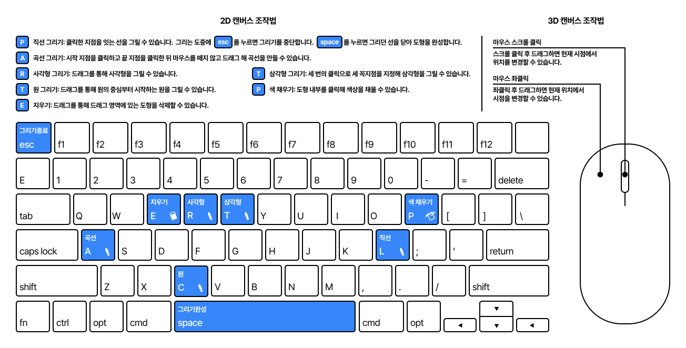

<br/>

# <span id="main-feature">두번째, 주요 기능 소개</span>

## <span id="main-feature-drawing">그리기 도구 조작해서 그려보기</span>

### 1. 스케치 기능

<table style="width: 660px;">
  <thead>
    <tr>
      <th style="text-align: center;">폴리라인 도구 (단축키 P)</th>
      <th style="text-align: center;">베지어 곡선 도구 (단축키 A)</th>
    </tr>
  </thead>
  <tbody>
    <tr>
      <td style="text-align: center; border: 1px solid #ddd; padding: 8px;">
        
      </td>
      <td style="text-align: center; border: 1px solid #ddd; padding: 8px;">
        
      </td>
    </tr>
    <tr>
      <td style="text-align:center;">
        시작점 설정 이후 클릭 할 때마다 새로운 선을 만들고, space 입력시 선을 닫아 도형을 만들 수 있습니다.
      </td>
      <td style="text-align:center;">
        시작점 클릭하고 종료점 클릭시 원하는 굴곡 방향으로 드래그 해 곡선을 그릴 수 있습니다.
      </td>
    </tr>
  </tbody>
</table>

<br/><br/>

<table style="width: 1000px;">
  <thead>
    <tr>
      <th style="text-align: center;">사각형 도구 (단축키 R)</th>
      <th style="text-align: center;">삼각형 도구 (단축키 T)</th>
      <th style="text-align: center;">원형 도구 (단축키 C)</th>
    </tr>
  </thead>
  <tbody>
    <tr>
      <td style="text-align: center;">
        
      </td>
      <td style="text-align: center;">
        
      </td>
      <td style="text-align: center;">
        
      </td>
    </tr>
    <tr>
      <td style="text-align:center;">
        시작점 클릭하고 드래그를 시작해 종료점에서 종료하여 사각형을 그릴 수 있습니다.
      </td>
      <td style="text-align:center;">
        클릭한 세 점을 꼭지점으로 하는 삼각형을 그릴 수 있습니다.
      </td>
      <td style="text-align:center;">
        클릭한 점을 중심으로 하는 원을 그릴 수 있습니다.
      </td>
    </tr>
  </tbody>
</table>

<br/><br/>

<table style="width: 1000px;">
  <tr>
    <th style="text-align: center;">페인트 도구 (단축키 P)</th>
    <th style="text-align: center;">지우개 도구 (단축키 E)</th>
    <th style="text-align: center;">이미지 가져오기 도구</th>
  </tr>
  <tr>
    <td style="text-align: center;">
      
    </td>
    <td style="text-align: center;">
      
    </td>
    <td style="text-align: center;">
      
    </td>
  </tr>
  <tr>
    <td style="text-align:center;">
    레이어를 식별할 수 있도록 닫힌 스케치 내부에 색상을 채울 수 있습니다.
    </td>
    <td style="text-align:center;">
    드래그를 통해 범위내에 들어오는 도형을 삭제 합니다.
    </td>
    <td style="text-align:center;">
      이미지를 가져와 캔버스에 띄워 볼 수 있습니다.
    </td>
  </tr>
</table>

<br/><br/>

### 2. 레이어 기능

<table style="width: 1000px;">
  <tr>
    <th style="text-align: center;">레이어 생성, 복사, 삭제</th>
    <th style="text-align: center;">레이어 온오프</th>
    <th style="text-align: center;">레이어 색상 지정</th>
  </tr>
  <tr>
    <td style="text-align: center;">
      
    </td>
    <td style="text-align: center;">
      
    </td>
    <td style="text-align: center;">
      
    </td>
  </tr>
  <tr>
    <td style="text-align:center;">
      레이어 버튼을 통해 생성, 복사, 삭제 기능을 사용할 수 있습니다.
    </td>
    <td style="text-align:center;">
      레이어 온오프 버튼을 통해 중첩레이어를 비교해 볼 수 있습니다.
    </td>
    <td style="text-align:center;">
      레이어의 색상을 지정해 스케치 화면에서 레이어를 더 잘 식별할 수 있습니다.
    </td>
  </tr>
</table>

<br/><br/>

## <span id="main-feature-rendering">설정값 조절해 렌더링하기</span>

### 1. 렌더링 관련 설정

<table width="330px">
  <tr>
    <th style="text-align: center;">렌더링 두께 및 높이 설정</th>
  </tr>
  <tr>
    <td>
      
    </td>
  </tr>
  <tr>
    <td style="text-align:center;">
      그려진 스케치 레이어에 두께(h값), 시작 높이(z값)을 설정하여 렌더링 속성을 지정할 수 있습니다.
    </td>
  </tr>
</table>

<br/><br/>

### 2. 카메라 관련 설정

<table style="width: 660px;">
  <tr>
    <th style="text-align: center;">렌더링 시점 변경</th>
    <th style="text-align: center;">렌더링 카메라 변경</th>
  </tr>
  <tr>
    <td style="text-align: center;">
      
    </td>
    <td style="text-align: center;">
      
    </td>
  </tr>
  <tr>
    <td style="text-align:center;">
      생성된 모델을 확대 및 축소, 회전하여 시점을 변경할 수 있습니다.
    </td>
    <td style="text-align:center;">
      설정된 카메라 옵션을 클릭해 카메라를 변경할 수 있습니다.
    </td>
  </tr>
</table>

<br/>

## <span id="main-feature-user">사용자 계정 추가 및 관리하기</span>

### 1. 회원가입

<table width=330px;>
  <tr>
    <td>
      
    </td>
  </tr>
</table>
<li>모든 입력필드에 대해 유효성 검사를 통과하는 경우 회원가입이 가능합니다.</li>
<li>회원가입이 완료되면 회원정보는 Firebase Authentication에 저장됩니다.</li>

<br/><br/>

### 2. 로그인 및 로그아웃

<table style="width: 1000px;">
  <thead>
    <tr>
      <th style="text-align: center;">구글 로그인</th>
      <th style="text-align: center;">일반 로그인</th>
      <th style="text-align: center;">로그아웃</th>
    </tr>
  </thead>
  <tbody>
    <tr>
      <td style="text-align: center; border: 1px solid #ddd; padding: 8px;">
        
      </td>
      <td style="text-align: center; border: 1px solid #ddd; padding: 8px;">
        
      </td>
      <td style="text-align: center; border: 1px solid #ddd; padding: 8px;">
        
      </td>
    </tr>
  </tbody>
</table>

<li>일반 로그인 시 입력된 이메일과 비밀번호를 Firebase에서 확인해 로그인합니다.</li>
<li>구글 로그인 시 로그인 되어있는 구글 계정으로 로그인합니다.</li>
<li>저장된 로그인 유저 정보를 제거합니다.</li>

<br/><br/>

# <span id="develop-log">세번째, 개발 과정 기록</span>

## <span id="develop-log-draw">사용자 입력 값을 통한 선 그리기 및 저장 구현하기</span>

사용자가 그린 선을 통해 3D 렌더링을 하려면 단순히 선 형태의 이미지가 아니라 선 자체가 값을 가져야 했습니다.
특히 직선뿐만 아니라 곡선, 다각형 등 다양한 형태의 도형도 그릴 수 있어야 했기 때문에 몇가지 조건이 있었습니다.

- 확대, 축소 시 픽셀이 깨지는 등의 품질 저하 없이 선명한 도형을 유지해야합니다.
- 그리기 도구를 이용한 다양한 형태의 스케치를 일관된 방식으로 처리해야 합니다.
- 사용자가 그린 2D 스케치를 3D 렌더링으로 변환할 수 있는 데이터로 저장해야 합니다.

먼저, 가장 기본적인 요구사항 부터 해결해보려고 했습니다.

<br/>

### 1. 품질 저하가 일어나지 않는 그래픽 형식은 무엇이 있을까?

**1) SVG:**
<br/>

- 벡터기반 그래픽 포맷으로 수학적으로 이미지를 정의합니다.
- 확대, 축소 시 품질 저하가 없고 파일 크기가 작습니다.
- XML 기반으로 편집이 가능하고, 웹표준을 따릅니다.

**2) PNG:**
<br/>

- 래스터 그래픽 포맷입니다.
- 투명도를 지원합니다.
- 확대, 축소시 품질 저하가 발생할 수 있습니다.

**3) EPS:**
<br/>

- 벡터, 래스터 이미지를 모두 포함하는 그래픽 포맷입니다.
- 다양한 디자인 요소를 사용할 수 있습니다.
- 웹 브라우저에서 직접 지원하지 않습니다.

<br/>

> [!NOTE]
> 조사 결과를 토대로 1. **웹표준을 지원**하고 2. **품질 저하**가 없으며 3. **수정이 가능**한 SVG 그래픽 포맷을 적용하고자 했습니다.

<br/>

### 2. 사용자가 그리는 다양한 도형들을 어떻게 효과적이고 일관된 방식으로 저장할 수 있을까?

처음에는 단순히 자유선형으로 그리는 방식을 생각했었지만 그렇게 되면 SVG 그래픽 포맷의 이점을 잃는다는 생각이 들었습니다.
SVG는 다양한 속성을 지원하는데, 현재 필요한 기능에는 모든 속성이 필요하지는 않았습니다.

예를 들면, 각 그리기 도구에 필요한 SVG 속성들을 분석해본 결과는 다음과 같습니다.

- 폴리라인 도구: `points`, `closePath()`
- 베지어 곡선 도구: `moveTo()`, `quadraticCurveTo()`
- 사각형 도구: `x`, `y`, `width`, `height`
- 삼각형 도구: `points`
- 원 도구: `cx`, `cy`, `r`
- 공통: `stroke`, `stroke-width`, `fill`

<br/>

SVG의 모든 속성들이 그리기 도구 로직에 필요하지 않기 때문에 JavaScript 객체로 SVG와 유사한 구조를 만들기로 결정했습니다.

> [!NOTE]
> 이러한 방식을 채택한 이유는 다음과 같습니다.
>
> 1. 필요한 속성만 정의하여 데이터를 가볍게 유지할 수 있었습니다.
> 2. 3D 렌더링에 필요한 추가 속성들을 쉽게 추가할 수 있었습니다.
> 3. JavaScript 객체로 작성되어 데이터 조작 및 관리가 더 용이했습니다.
>
> 이러한 방식으로 사용자가 그린 스케치를 벡터 그래픽 포맷으로 저장하면서, 필요한 다른 속성들도 쉽게 추가할 수 있게 되었습니다.

<br/>

### 3. 그린 도형을 좌표값으로 어떻게 저장해야 할까?

사용자의 편의성을 위해 여러 종류의 그리기 도구를 추가해야했습니다.
<br/>
그리기 도구들에 대해 조사를 하다보니 만들어질 도형마다 필요한 속성들이 조금씩 달랐고 일관된 데이터 관리를 위해 구조를 정리해야 했습니다.

먼저 필요한 속성들을 전부 정리해 공통 속성과, 개별속성으로 구분했습니다.

**1) 공통 속성**

```javascript
{
  id: String,          // 고유한 값(uuid)
  index: Number,       // 레이어 인덱스
  name: String,        // 레이어 이름
  path: Array,         // 도형의 좌표값
  fill: String,        // 도형의 채우기 색상
  visible: Boolean,    // 도형의 표시 여부
  type: "draw",        // 기본값은 "draw", 이미지 레이어의 경우 "image"
  height: Number,      // 렌더링 시 해당 레이어의 두께
  zIndex: Number       // 렌더링 시 해당 레이어의 시작 높이
}
```

<br/>
<br/>

**2) 개별 속성**

- 폴리라인

  ```javascript
  {
    // 공통 속성...
    path: [
      {
        type: 'polyline',
        closed: Boolean, // 폴리라인 닫힘 여부
        fill: String, // 채우기 색상
        points: [
          // 폴리라인을 구성하는 점들의 x, y 좌표 배열
          { x: Number, y: Number },
          // 추가 점들...
        ],
      },
    ];
  }
  ```

<br/>

- <span id="bezier-curve">베지어 곡선</span>

  ```javascript
  {
    // 공통 속성...
    path: [
      {
        type: 'closedBezier',
        fill: String, // 채우기 색상
        curves: [
          {
            // 베지어 곡선 세그먼트들의 배열
            type: 'bezier',
            cx: Number, // 제어점 x 좌표
            cy: Number, // 제어점 y 좌표
            x1: Number, // 시작점 x 좌표
            x2: Number, // 끝점 x 좌표
            y1: Number, // 시작점 y 좌표
            y2: Number, // 끝점 y 좌표
          },
          {
            // 곡선을 닫는 직선의 배열
            type: 'line',
            x1: Number, // 시작점 x 좌표
            x2: Number, // 끝점 x 좌표
            y1: Number, // 시작점 y 좌표
            y2: Number, // 끝점 y 좌표
          },
        ],
      },
    ];
  }
  ```

<br/>

- 사각형
  ```javascript
  {
    // 공통 속성...
    path: [
      {
        type: 'rectangle',
        fill: String, // 채우기 색상
        height: Number, // 사각형의 높이 (y축 길이)
        width: Number, // 사각형의 너비 (x축 길이)
        x: Number, // 좌상단 모서리의 x 좌표
        y: Number, // 좌상단 모서리의 y 좌표
      },
    ];
  }
  ```

<br/>

- 삼각형
  ```javascript
  {
    // 공통 속성...
    path: [
      {
        type: "triangle"
        fill: String,    // 채우기 색상
        points: [        // 삼각형의 세 꼭지점의 x, y 좌표
          { x: Number, y: Number },
          { x: Number, y: Number },
          { x: Number, y: Number }
        ],
      }
    ]
  }
  ```

<br/>

- 원형

  ```javascript
  {
    // 공통 속성...
    path: [
      {
        type: 'circle',
        fill: String, // 채우기 색상
        center: {
          // 원의 중심점의 x, y 좌표
          x: Number,
          y: Number,
        },
        radius: Number, // 원의 반지름
      },
    ];
  }
  ```

  <br/>

> [!NOTE]
> 이런 방식으로 그려진 도형을 저장하는 구조를 일관성, 확장성을 고려해 정리했습니다.
>
> 공통 속성을 통해 데이터 관리의 일관성을 확보하였고, 개별 속성을 통해 다양한 도형을 정확히 표현할 수 있도록 했습니다.

<br/>
<br/>

## <span id="develop-log-draw-complex">다중 선과 곡선을 사용한 복잡한 도형 그리기 및 저장 구현하기</span>

x, y 좌표값로 이루어져있는 비교적으로 단순한 도형을 제외하고 폴리라인과 베지어 곡선은<br/>
로직을 작성하는데 많은 어려움이 있었습니다.
<br/><br/>
먼저 폴리라인을 작성하는 로직을 살펴보겠습니다.

<br/>

### 1. 여러 직선을 이어 그리는 폴리라인 도구

<div align="center">


<span align="right" style="color: gray">폴리라인 그리기 도구</span>

</div>

폴리라인은 원하는 지점을 계속 클릭해 선을 그릴 수 있게 하는 도구입니다.
<br/>
사용자의 클릭으로 계속 새로운 선을 그려나가기 때문에 시작, 진행, 종료 단계를 정확히 구분하는 것이 중요했습니다.
<br/>
이를 위해 키보드 이벤트도 추가해 그리기 완료, 취소 기능을 구현하였습니다.

이러한 목적으로 구현한 폴리라인 그리기 로직의 순서를 이벤트 기준으로 도식화하면 다음과 같습니다.

<br>

#### 1-1. `mousedown` 이벤트


**#01)**
<br/>1. canvasRef에 담아 가져온 canvas요소의 크기를 통해 클릭한 위치의 좌표를 계산합니다.
<br/>2. 그리는 상태를 판별하는 isDrawing 변수를 true로 설정합니다. (기본값은 false)
<br/>3. 전역 상태의 변수인 currentPolyline 배열에 해당 좌표를 추가합니다.
```javascript
const handleStart = () => {
  const canvas = canvasRef.current; // canvas 엘리먼트
  const rect = canvas.getBoundingClientRect(); // 크기 계산
  // mouse 좌표 계산
  let mouseX = (event.clientX - rect.left) / scale;
  let mouseY = (event.clientY - rect.top) / scale;
  
  // 근처에 스냅포인트가 있는 경우 mouseX,Y 값 재할당
  
  const point = { x: mouseX, y: mouseY };

  if (!isDrawingPolyline || currentPolyline.length === 0) {
    // 그리는 중이 아니거나 추가된 점이 없는 없는 경우
    setIsDrawingPolyline(true); // 그리는 중으로 변경
    setCurrentPolyline([point]); // 폴리라인 점 추가
  }
}
```

**#02)**
<br/>4. `isDrawing` 변수를 확인합니다. 6. `true`인 경우 즉, 이미 그리기 중인 경우 새로운 점을 `currentPolyline` 배열에 추가합니다.
```javascript
if (!isDrawingPolyline || currentPolyline.length === 0) {
    // 처음 클릭 로직
  } else {
    // 그리는 중이고 추가된 점이 있는 경우
    // ... 
    setCurrentPolyline((prev) => [...prev, point]); // 새로운 점 추가
  }
```

**#03)**
<br/>5. `keydown` 이벤트가 발생하기 전까지 상기 과정을 반복합니다.

<br/>

#### 1-2. `keydown` 이벤트 - `Space`


**#01)**
<br/>1. `space` 키를 누른 경우 finalizeLine 함수를 호출합니다.
<br/>2. 호출된 finalizeLine 함수에서 입력된 점이 2개 이상인 경우 closedPath 객체를 만들어 레이어에 업데이트 합니다.
```javascript
const handleKeyDown = () => {
  if (event.key === ' ' && selectedTool === 'line' && isDrawingPolyline) {
    drawLine.finalizeLine();
  }
}

const finalizeLine = () => {
  if (currentLayer && isDrawingPolyline && currentPolyline.length > 2) {
    const closedPath = {
      type: 'polyline',
      points: uniquePoints,
      closed: true,
      fill: 'none',
    }; // polyline path 객체 생성

    const updatedLayer = {
      ...currentLayer,
      path: [...(currentLayer.path || []), closedPath],
    }; // polyline을 path 에 추가한 새로운 레이어 객체 생성

    await updateLayerInFirestore(updatedLayer); // firestore에 업데이트
  }
}
```

**#02)**
<br/>3. `beginPath` 메소드를 이용해 선그리기를 시작합니다.
<br/>4. `moveTo()` 메소드로 `currentPolyline`의 첫번째 점(폴리라인의 시작점)으로 이동합니다.
<br/>5. `for()` 반복문을 통해 나머지 점들을 순회하며 `lineTo()` 메소드로 가상의 선을 그립니다.
```javascript
const renderToolLine = (ctx) => {
  ctx.beginPath(); // 선 생성 시작
  ctx.moveTo(currentPolyline[0].x, currentPolyline[0].y); // 첫번째 점으로 이동

  for (let i = 1; i < currentPolyline.length; i += 1) {
    // 반복문을 통해 이어 그리기
    ctx.lineTo(currentPolyline[i].x, currentPolyline[i].y);
  }
}
```

**#03)**
<br/>6. `stroke()` 메소드로 가상의 선을 실제 선으로 변환해 캔버스에 그립니다.

```javascript
const renderToolLine = (ctx) => {
  // 선 그리기 로직
  ctx.stroke(); // 캔버스에 실제 선 그리기
}
```

<br/>

#### 1-3. `keydown` 이벤트 - `Escape`


**#01)**
<br/>1. esc를 누르면 라인 그리기 중인지 확인합니다.
<br/>2. 맞다면 cancelLine 함수를 호출합니다.
```javascript
if (event.key === 'Escape') {
  if (selectedTool === 'line' && isDrawingPolyline) {
    drawLine.cancelLine();
  }
}
```

**#02)**
<br/>3. 그리기 상태와 속성을 저장한 모든 변수를 초기화합니다.
```
const cancelLine = () => {
  // 변수 초기화
  setIsDrawingPolyline(false);
  setCurrentPolyline([]);
  setLineStart(null);
  setLineEnd(null);
};
```

**#03)**
<br/>4. canvas를 렌더링하는 함수인 renderCanvas를 호출해 캔버스를 새로고침합니다.
```javascript
const cancelLine = () => {
  // 변수 초기화 로직

  // 초기화 한 뒤 canvas 다시 그림
  renderCanvas();
}
```

<br/><br/>

### 2. 세개의 조절점을 통해 그린 3점 베지어 곡선 도구

<br/>

<div align="center">


<span align="right" style="color: gray">베지어 곡선 그리기 도구</span>

</div>

베지어 곡선은 조절점을 사용해 곡선을 그릴 수 있는 도구입니다.

베지어 곡선은 조절점의 개수에 따라 n차 베지어 곡선이 존재합니다.
<br/>
그 중 1개의 조절점을 사용하는 2차 베지어 곡선을 사용한 이유는 다음과 같습니다.

- 1개의 조절점으로도 곡선을 쉽게 그릴 수 있어, 간단한 인터페이스를 구현하고자 하는 목표에 부합했습니다.
- 여러개의 2차 베지어 곡선을 연결해 복잡한 형태 또한 표현 가능합니다.
- 구현이 상대적으로 간단하기 때문에 길지 않은 개발기간에 적합했습니다.

<br/>

이러한 목적으로 구현한 베지어 곡선 그리기 로직의 순서를 이벤트 기준으로 도식화하면 다음과 같습니다.

<br/>

#### 2-1. `mousedown` 이벤트

  

**#01)**
<br/>1. canvasRef에 담아 가져온 canvas요소의 크기를 통해 클릭한 위치의 좌표를 계산합니다.
<br/>2. 그리는 상태를 판별하는 `isBezierDrawing`를 `true`로 설정합니다. (기본값은 `false`)
<br/>3. 베지어 곡선의 `bezierStart`에 해당 좌표를 추가합니다.
```javascript
const handleStart = () => {
  // 좌표계산 로직
  if (!bezierStart) {
    // 첫번째 클릭인 경우(시작점이 없는 경우)
    setBezierStart(point); // 시작점 설정
    setIsBezierDrawing(true); // 그리는 중임을 알리는 변수
  }
}
```

**#02)**
<br/>4. 두번째 클릭시 `bezierEnd` 를 현재 마우스 위치 좌표로 설정합니다.
```javascript
const handleStart = () => {
  // 좌표계산 로직

  if (!bezierStart) {
    //  첫번째 클릭 로직
  } else if (!bezierEnd) {
    // 두번째 클릭인 경우(끝점이 없는 경우)
      setBezierEnd(point); // 끝점 설정
  }
}
```

**#03)**
<br/>5. `bezierControl` 을 현재 마우스 위치로 초기화합니다.
```javascript
const handleStart = () => {
  // 좌표계산 로직

  if (!bezierStart) {
    //  첫번째 클릭 로직
  } else if (!bezierEnd) {
    // 두번째 클릭인 경우(끝점이 없는 경우)
      setBezierEnd(point);
      setBezierControl(point); // 조절점 설정
  }
}
```

<br/>

#### 2-2. `mousemove` 이벤트

  

**#01)**
<br/>1. `isBezierDrawing` 변수가 `true`이고 `bezierStart`, `bezierEnd` 가 설정되었는지 확인합니다.
```javascript
const handleMove = () => { 
  // 좌표계산 로직

  if(isBezierDrawing && bezierStart && bezierEnd) {
    // 시작점, 끝점이 존재하고 그리는 중인 경우
  }
}
```

**#02)**
<br/>2. 모든 조건이 참인 경우 `bezierControl` 을 변경된 마우스 위치로 업데이트 합니다.
```javascript
const handleMove = () => { 
  // 좌표계산 로직

  if(isBezierDrawing && bezierStart && bezierEnd) {
    // 시작점, 끝점이 존재하고 그리는 중인 경우
    setBezierControl(point);
  }
}
```

**#03)**
<br/>3. 마우스 위치를 계속 추적하며 `bezierControl` 을 계속 업데이트 합니다.

<br/>

#### 2-3. `mouseup` 이벤트

  

**#01)**
<br/>1. `bezierStart`, `bezierEnd`, `bezierControl` 이 전부 설정되었는지 확인합니다.
<br/>2. 경로를 담을 수 있는 `closedBezier` 객체를 생성합니다.
<br/>3. 이 객체의 형태가 <a href="#bezier-curve">베지어 곡선의 개별 속성</a>으로 정의됩니다.
```javascript
const handleEnd = () => {
  if (bezierStart && bezierEnd && bezierControl) {
    const newPath = {
        type: 'closedBezier',
        curves: [
          {
            type: 'bezier', // 조절점을 이용해 구한 곡선
            // 좌표값
          },
          {
            type: 'line', // 곡선을 닫아주는 선
            // 좌표값
          },
        ],
        fill: 'none',
      };
  }
}
```

**#02)**
<br/>6. `beginPath()` 메소드로 선그리기를 시작합니다.
<br/>7. 첫번째 경로를 확인해 `moveTo` 메소드로 해당 점(시작점)으로 이동합니다.
<br/>8. `quadraticCurveTo()`메소드로 제어점, 끝점값을 통해 가상의 곡선을 그립니다.
```javascript
const renderToolBezier = (ctx) => {
  if (bezierStart && bezierEnd) {
    ctx.beginPath(); // 선 그리기 시작
    ctx.moveTo(bezierStart.x, bezierStart.y); // 시작점으로 이동
    ctx.quadraticCurveTo(
      bezierControl ? bezierControl.x : currentMousePos.x,
      bezierControl ? bezierControl.y : currentMousePos.y,
      bezierEnd.x,
      bezierEnd.y,
    ); // 곡선 그리기
    ctx.strokeStyle = 'tomato';
  }
}
```

**#03)**
<br/>11. `stroke()` 메소드로 실제 캔버스에 곡선을 그립니다.
```javascript
const renderToolBezier= (ctx) => {
  if (bezierStart && bezierEnd) {
    // 가상의 bezier 곡선 생성 로직
    ctx.stroke(); // 캔버스에 bezier 곡선 그리기
  }
}
```

<br/><br/>

### 3. 드래그를 통한 사각형 그리기 도구

<br/>

<div align="center">
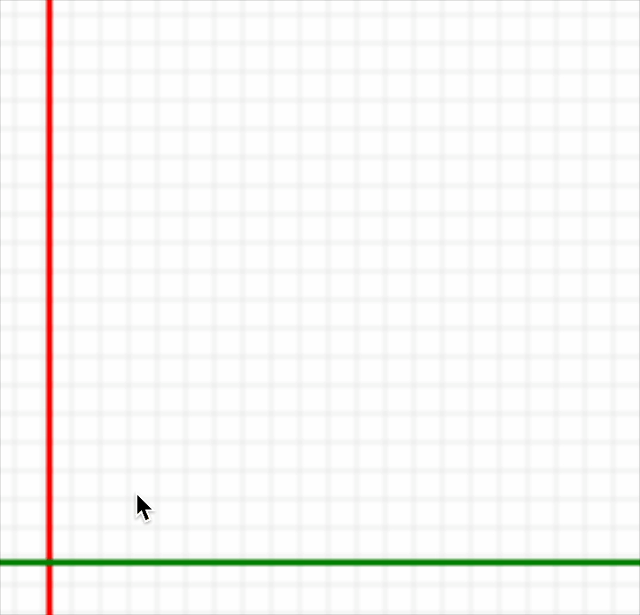

<span align="right" style="color: gray">사각형 그리기 도구</span>

</div>

사각형 그리기 도구는 드래그 한번으로 원하는 크기의 사각형을 그려주는 도구입니다.
<br/>
기능 구현을 위해서는 먼저 처음 클릭(mousedown)한 지점과 클릭을 뗀(mouseup) 지점의 좌표를 알아야했습니다.
<br/>
이러한 방식으로 구현한 사각형 그리기 로직의 순서를 이벤트 기준으로 도식화 하면 다음과 같습니다.
<br/>

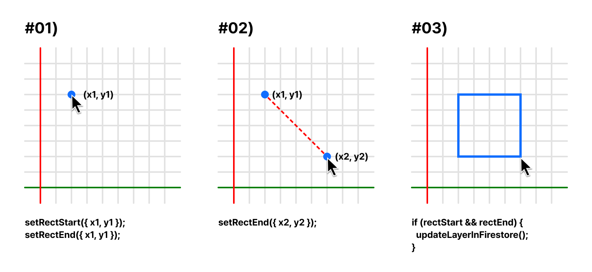

<br/>

**#01)**
<br/>1. `mousedown` 이벤트가 일어난 캔버스 좌표를 시작점과 끝점에 입력합니다.
```javascript
const handleStart = (event, state) => {
  // 좌표계산 로직

  setRectStart({ x: mouseX, y: mouseY }); // 시작점 좌표
  setRectEnd({ x: mouseX, y: mouseY }); // 끝점 좌표
}
```

**#02)**
<br/>2. `mousemove` 이벤트를 통해 끝점의 좌표를 업데이트합니다.
```javascript
const handleMove = (event, state) => {
  // 좌표계산 로직

  setRectEnd(point); // 끝점 업데이트
}
```

**#03)**
<br/>3. `mouseup` 이벤트가 일어났을때 시작점과 끝점이 존재한다면 사각형의 정보를 저장해 렌더링합니다.
```javascript
const handleEnd = (event, state) => {
  if (rectStart && rectEnd) {
    // 시작점과 끝점이 존재하는 경우
    const newPath = {
      type: 'rectangle',
      x: Math.min(rectStart.x, rectEnd.x),
      y: Math.min(rectStart.y, rectEnd.y),
      width: Math.abs(rectEnd.x - rectStart.x),
      height: Math.abs(rectEnd.y - rectStart.y),
      fill: 'none',
    }; // path 객체에 사각형 정보 저장
  
    const updatedLayer = {
      ...currentLayer,
      path: [...currentLayer.path, newPath],
    }; // path를 추가한 새로운 레이어 객체 생성

    await updateLayerInFirestore(updatedLayer); // firestore에 레이어 업데이트
  }
}
```

<br/>

### 4. 세번의 클릭을 통한 삼각형 그리기 도구

<br/>

<div align="center">
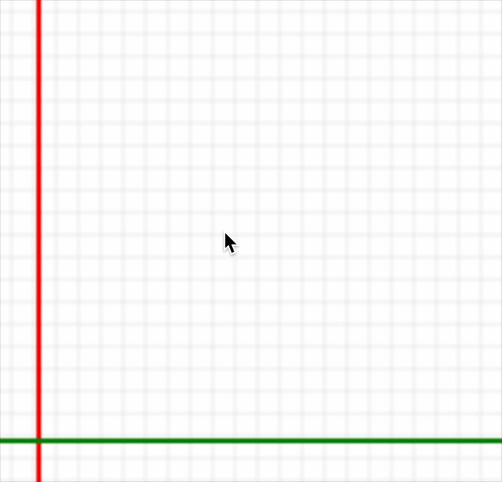

<span align="right" style="color: gray">삼각형 그리기 도구</span>

</div>

사용자는 삼각형 그리기 도구로 모서리 위치를 클릭해 삼각형을 만들 수 있습니다.
<br/>
삼각형을 그리기 위해 사용자가 입력한 세개의 모서리 좌표 데이터가 필요했습니다.
<br/>
이러한 목적으로 구현한 삼각형 그리기 로직의 순서를 이벤트 기준으로 도식화하면 다음과 같습니다.
<br/>

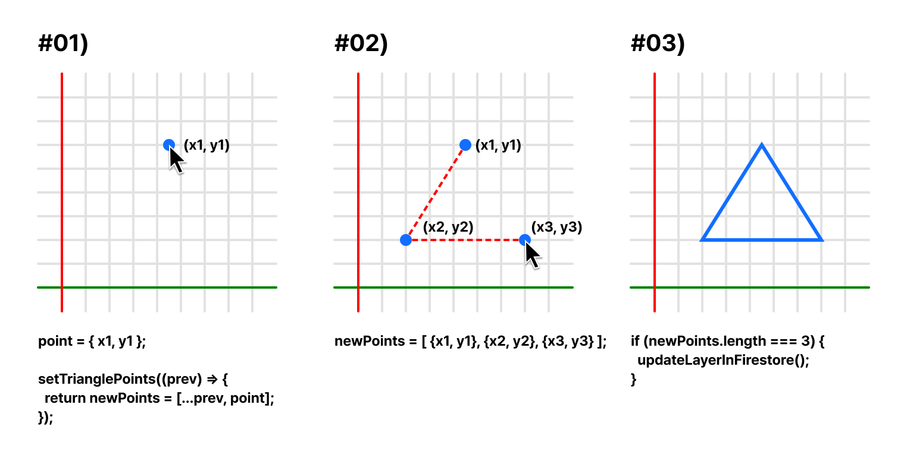

<br/>

**#01)**
<br/>1. `mousedown` 이벤트를 통해 꼭지점의 좌표를 저장합니다.
```javascript
const handleStart = (event, state) => {
  // 좌표계산 로직

setTrianglePoints((prevPoints) => {
  const newPoints = [...prevPoints, point];

  return newPoints;
});
```

**#02)**
<br/>2. 저장된 꼭지점이 3개가 될 때까지 계속 저장합니다.

**#03)**
<br/>3. 저장 후 꼭지점이 3개가 된 경우 삼각형의 정보를 저장하고 렌더링합니다.
```javascript
if (newPoints.length === 3) {
  if (selectedLayer) {
    addPathToLayer(selectedLayer.index, {
      type: 'triangle',
      points: newPoints,
    });
  }
  return [];
}
```

<br/>

### 5. 중심점을 기준으로 하는 원 그리기 도구

<br/>

<div align="center">
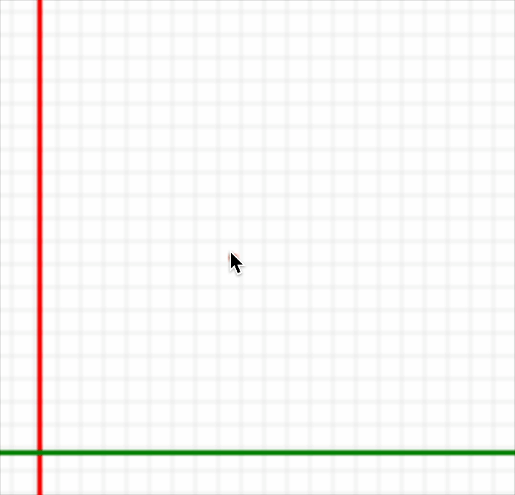

<span align="right" style="color: gray">원 그리기 도구</span>

</div>

원 그리기 도구는 중심점을 기준으로 원하는 반지름을 설정해 원을 만들 수 있는 도구입니다.
<br/>
원을 그리기 위해 사용자가 지정한 중심점과 드래그를 통해 반지름을 구해 해당하는 원의 크기를 구해야 했습니다.
<br/>
이를 위해 원 그리기 로직의 순서를 이벤트 기준으로 도식화하면 다음과 같습니다.
<br/>

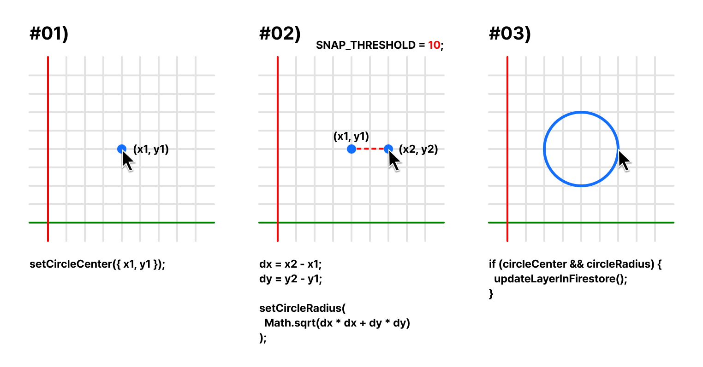

<br/>

**#01)**
<br/>1. `mousedown` 이벤트를 통해 원의 중심 좌표를 저장합니다.
```javascript
const handleStart = () => {
  // 좌표계산 로직

  setCircleCenter({ x: mouseX, y: mouseY }); // 원의 중심 좌표 저장
};
```

**#02)**
<br/>2. `mousemove` 이벤트가 발생하면 마우스의 현재 위치와 중심 좌표를 계산해 결과(반지름)를 저장합니다.
```javascript
const handleMove = () => {
  // 좌표계산 로직

  const dx = mouseX - circleCenter.x; // 현재 마우스 위치의 x 좌표와 중심의 x 좌표 차이
  const dy = mouseY - circleCenter.y; // 현재 마우스 위치의 y 좌표와 중심의 y 좌표 차이
  setCircleRadius(Math.sqrt(dx * dx + dy * dy)); // 원의 반지름 저장
};
```

**#03)**
<br/>3. `mouseup` 이벤트가 발생하고 중심좌표와 반지름이 존재하면 원의 정보를 저장하고 렌더링합니다.
```javascript
if (circleCenter && circleRadius) {
  const newPath = {
    type: 'circle',
    center: circleCenter,
    radius: circleRadius,
  }; // path 객체에 삼각형의 정보 저장

  const updatedLayer = {
    ...currentLayer,
    path: [...currentLayer.path, newPath],
  }; // 새로운 레이어에 path 값 저장
  
  await updateLayerInFirestore(updatedLayer);
  // firestore에 새로운 레이어 업데이트
}
```
<br/>

## <span id="develop-log-draw-user">그리기 도구에 사용자 경험을 고려한 기능 추가하기</span>

### 1. 그려진 도형의 모서리를 표시해주는 스냅포인트

스냅 포인트는 도형의 특정 모서리를 정확히 접근가능하게 도와주는 도구입니다.
<br/>
사용자가 기존 도형에 이어서 새로운 도형을 그릴 경우 정확한 점을 추적할 수 있게 도와줍니다.
<br/><br/>
마우스 이벤트를 통해 구현한 스냅 포인트 로직의 순서를 이벤트 기준으로 도식화하면 다음과 같습니다.


<br/>

**#01)**
<br/>1. `mousemove` 이벤트를 통해 마우스가 움직일때마다 그려진 도형의 점들을 확인합니다.
```javascript
const handleMouseMove = (event) => {
  // 마우스 무브 이벤트 발생시마다 findSnapPoint 함수 실행
  findSnapPoint();

  // ...
}
```

**#02)**
<br/>2. 해당 점과 마우스의 좌표를 계산해 거리가 설정된 `SNAP_THRESHOLD`의 값보다 작은지 확인합니다.
```javascript
const findSnapPoint = () => {
  // 좌표계산 로직

  const nearestPoint = findNearPoint(mouseX, mouseY, scale, layerList);

  // 마우스의 위치를 통해 findNearPoint 함수 실행해 존재하면 snapPoint에 저장
  if (nearestPoint) {
    mouseX = nearestPoint.x;
    mouseY = nearestPoint.y;
    setSnapPoint({ x: mouseX, y: mouseY });
  } else {
    setSnapPoint(null);
  }
}

const findNearPoint = () => {
  // 각 path의 타입마다 확인하며 점들을 points 배열에 저장
  layer.path.forEach((path) => {
    let points = [];

    switch (path.type) {
      case 'rectangle':
      case 'line':
      case 'polyline':
      case 'triangle':
      case 'bezier':
      case 'closedBezier':
      case 'circle':
      default:
        break;
    }

  const checkPoint = (point) => {
    // 현재 마우스와 점의 거리
    const distance = Math.sqrt((x - point.x) ** 2 + (y - point.y) ** 2);

    // 거리가 스냅포인트 설정 거리보다 작을때
    if (distance < minDistance && distance < SNAP_THRESHOLD / scale) { 
      minDistance = distance;

      // 스냅포인트가 될 점 리턴
      nearest = point;
    }
  };


  // 각 점들을 순회하며 마우스 근처에 있는지 확인
  points.forEach(checkPoint);
}
```

**#03)**
<br/>3. `SNAP_THRESHOLD`의 값보다 작은 경우 스냅포인트를 표시합니다.
```javascript
const renderSnapPoint = () => {
  // 그리는 중인 경우
  if (
      snapPoint &&
      (selectedTool === 'line' ||
        selectedTool === 'bezier' ||
        selectedTool === 'rectangle' ||
        selectedTool === 'triangle' ||
        selectedTool === 'circle')
    ) {
    // 스냅 포인트 그리기 로직
    ctx.beginPath();
    ctx.arc();
   } 
}  
```

<br/>

### 2. 그려질 선을 미리볼 수 있는 예상 그리기 선 표시

예상 그리기 선 표시를 통해 사용자는 그려질 선을 확인하며 작업할 수 있습니다.
<br/>
이를 위해 마우스 이벤트를 통해 구현한 예상 그리기 선 표시 로직을 이벤트 기준으로 도식화하면 다음과 같습니다.


<br/>

**#01)**
<br/>1. 어떤 도구를 통해 그리고 있는지 확인합니다.
```javascript
const renderCurrentTool = () => {
  switch (selectedTool) {
    case 'line':
      renderToolLine(ctx, { ...props });
      break;
    // 다른 tool
}
```

**#02)**
<br/>2. `mousemove` 이벤트를 통해 마우스의 위치를 계속 확인합니다.
```javascript
const renderToolLine = () => {
  if (lineEnd) {
    // 끝점이 존재하는 경우
  }
}
```

**#03)**
<br/>3. `context` 를 통해 선을 그리고 스타일을 부여합니다.
```javascript
if (lineEnd) {
    ctx.beginPath(); // 선 생성 시작

    ctx.moveTo(
      currentPolyline[currentPolyline.length - 1].x,
      currentPolyline[currentPolyline.length - 1].y,
    ); // 이전 점으로 이동

    ctx.lineTo(lineEnd.x, lineEnd.y); // 현재 점까지 선 그리기
    ctx.strokeStyle = 'tomato';
    ctx.lineWidth = 1;
    ctx.stroke(); // canvas에 실제 선으로 그림
  }
```
```

<br/>

### 3. 도형 내부의 색을 채우는 페인트 도구

레이어가 중첩되어있는 경우 페인트 도구를 통해 쉽게 식별할 수 있습니다.<br/>
마우스 이벤트를 통해 구현한 페인트 도구를 이벤트 기준으로 도식화 하면 다음과 같습니다.


<br/>

**#01)**
<br/>1. `mousedown` 이벤트가 발생한 시점의 마우스 좌표를 확인합니다.
```javascript
const handleStart = () => {
  // 좌표계산 로직
}
```

**#02)**
<br/>2. 선택된 레이어에 존재하는 모든 도형을 순회해 좌표들을 확인합니다.
<br/>3. 마우스 좌표와 도형의 좌표를 통해 내부를 클릭했는지 판단합니다.
```javascript
const handleStart = () => {
  // 좌표계산 로직

  const clickedLayer = layerList.find((layer) =>
    layer.path.some((path) => checkMousePoint(path, x, y)),
  ); // 레이어 순회

  if (clickedLayer) {
    const clickedPathIndex = clickedLayer.path.findIndex((path) =>
      checkMousePoint(path, x, y),
    ); // 마우스 좌표가 도형 내부에 있는지 판단해 해당하는 path의 인덱스 저장
  }
}
```

**#03)**
<br/>4. 내부가 클릭되었다면 `context`를 통해 `fill` 속성을 업데이트 합니다.
```javascript
if (clickedPathIndex !== -1) {
  const updatedLayer = {
    ...clickedLayer,
    path: clickedLayer.path.map((path, index) =>
      index === clickedPathIndex
        ? { ...path, fill: clickedLayer.fill } // 해당 path의 fill 색상을 업데이트
        : path,
    ),
  };

  updateLayerInFirestore(updatedLayer); // firestore에 새로운 레이어 업데이트
}
```

<br/>

### 4. 영역내의 도형을 지우는 지우개 도구

<br/>

<div align="center">
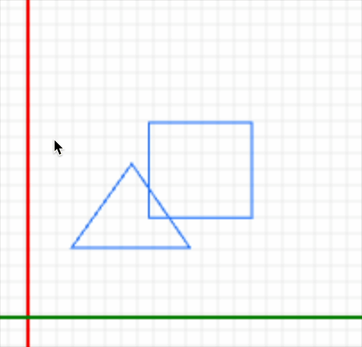

<span align="right" style="color: gray">지우개 도구</span>

</div>

지우개 영역 내에 있는 도형을 선택된 레이어에서 삭제합니다..<br/>
이를 위해 구현한 지우개 도구를 이벤트 기준으로 도식화 하면 다음과 같습니다.

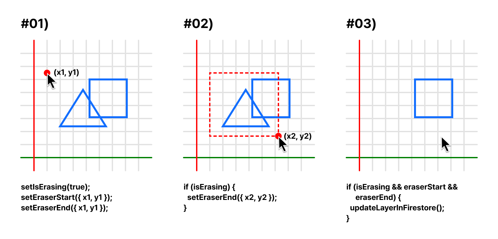

<br/>

**#01)**
<br/>1. `mousedown` 이벤트가 발생한 좌표를 시작점과 끝점에 저장합니다.
```javascript
const isPathInEraserArea = (path, area) => {
  // 좌표계산 로직

  setIsErasing(true); // 지우는 중인 상태
  setEraserStart({ x: mouseX, y: mouseY }); // 시작점 저장
  setEraserEnd({ x: mouseX, y: mouseY }); // 끝점 저장
}
```

**#02)**
<br/>2. `mousemove` 이벤트를 통해 끝점을 업데이트합니다.
```javascript
if (isErasing) {
  setEraserEnd({ x: mouseX, y: mouseY });
  // 지우는 중인 경우 끝점 업데이트
}
```

**#03)**
<br/>3. `mouseup` 이벤트가 일어나면 지우개 영역을 계산합니다.
<br/>4. 해당 레이어를 순회하여 지우개 영역내부에 존재하는 path를 제외하고 새로운 레이어를 생성합니다.
```javascript
const updatedPaths = currentLayer.path.filter((path) => {
  return !isPathInEraserArea(path, {
    start: eraserStart,
    end: eraserEnd,
  }); // path가 영역안에 존재 하지 않는 경우에만 updatedPaths에 추가
});

const updatedLayer = { ...currentLayer, path: updatedPaths }; // 새로운 레이어 생성
await updateLayerInFirestore(updatedLayer); // firebase에 새로운 레이어 업데이트
```

<br/>

### 5. 이미지 파일을 캔버스에 부착하는 이미지 추가 도구

<br/>

<div align="center">
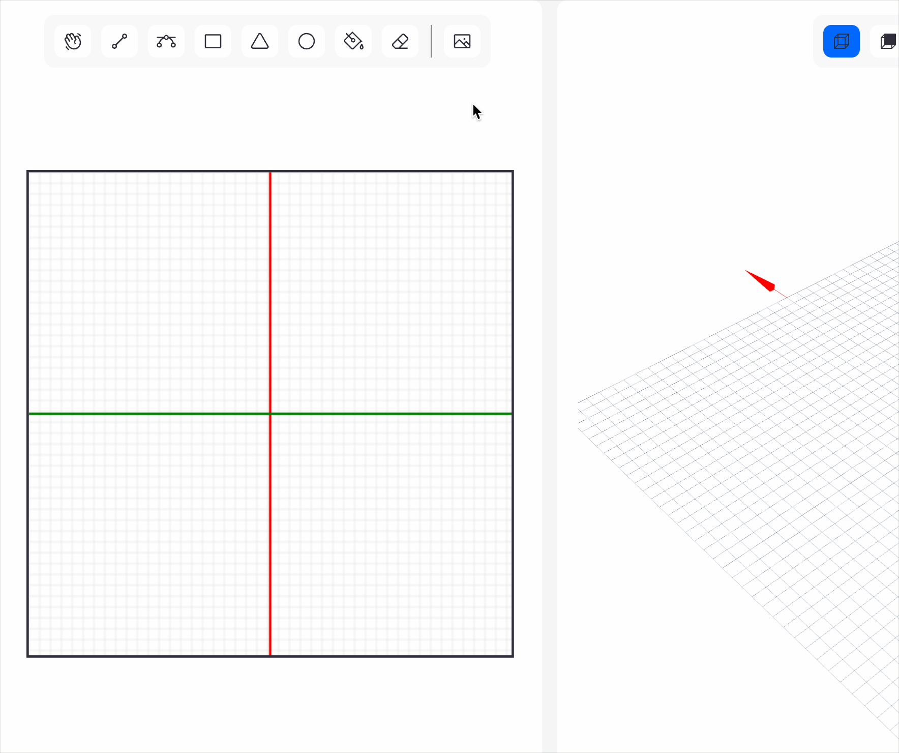

<span align="right" style="color: gray">이미지 추가 도구</span>

</div>

이미지를 캔버스에 추가해 이미지를 따라 그릴 수 있도록 합니다.<br/>
이미지를 불러오기 위한 로직의 흐름을 도식화 한다면 다음과 같습니다.

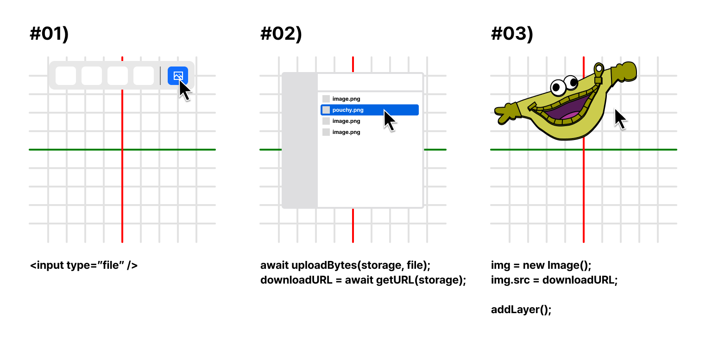

<br/>

**#01)**
<br/>1. type이 file인 `<input>` 태그를 통해 클릭하면 파일 선택창을 열어줍니다.
```html
<input
  type="file"
  ref={fileInputRef}
  style={{ display: 'none' }}
  accept="image/*"
  onChange={handleFileChange}
/>
```
```javascript
const handleImageImport = () => {
  fileInputRef.current.click();
};
```

**#02)**
<br/>2. 이미지를 선택하면 firestore storage에 업로드 합니다.
<br/>3. 해당 이미지의 경로를 통해 firestore storage로 부터 url을 가져옵니다.
```javascript
const handleFileChange = () => {
  const file = event.target.files[0];

  const storageRef = ref(storage, `images/${file.name}`);
  await uploadBytes(storageRef, file);

  const downloadURL = await getDownloadURL(storageRef);
}
```

**#03)**
<br/>4. 가져온 url을 이미지 객체에 저장하고 layer를 추가합니다.
```javascript
const newLayer = {
  type: 'image',
  name: file.name,
  imageUrl: downloadURL,
  width: Math.round(width),
  height: Math.round(height),
  x: 0,
  y: 0,
  rotation: 0,
  visible: true,
  opacity: 1,
};

addLayer(newLayer);
```

<br/>

## <span id="develop-log-render">완성된 스케치를 3D 모델로 렌더링하기</span>

### 저장된 2D 스케치의 좌표를 가져와 3D 모델링 및 렌더링

스케치를 하고 있는 2D 캔버스의 좌표를 가져와 3D 캔버스의 좌표에 렌더링합니다.<br/>
이 과정을 도식화 하면 다음과 같습니다.


<br/>

**#01)**
<br/>1. 그려진 2D 스케치의 좌표값을 확인합니다.
```js
```

**#02)**
<br/>2. 2D 좌표값을 3D 캔버스의 중심을 기준으로 변경합니다.
<br/>3. `Three.js`의 `Shape()` 메소드를 통해 도형을 생성합니다.
```js
```

**#03)**
<br/>4. 가져온 높이값으로 `Three.js`의 `(ExtrudeGeometry())` 메소드를 통해 모델링과 렌더링을 진행합니다.
```js
```

<br/>

## <span id="develop-log-render-user">더 나은 사용자 경험을 위한 3D 렌더링 화면 구성하기</span>

### 1. 3D 공간을 확인하기 위한 그리드와 3D 축

사용자가 작업을 하다보면 지금 보는 화면이 어떤 방향인지 인식하기 어려울 때가 있습니다.<br/>
이러한 기능을 제공해 공간감각을 제공하고, 거리와 크기 그리고 방향을 인식하기 쉽게 만듭니다.<br/><br/>
이 기능을 구현하기 위해 작성한 순서는 다음과 같습니다.


**#01)**
<br/>1. 2D 캔버스의 레이아웃 크기를 가져옵니다.
```js
```

**#02)**
<br/>2. 크기를 20개로 분할하여 그리드를 렌더링합니다.
```js
```

**#03)**
<br/>3. 렌더링한 그리드 위에 세개의 축을 추가해 가시성을 확보할 수 있게 하였습니다.
```js
```

<br/>

### 2. 작업 편의를 위한 카메라 세팅

사용자가 작업할 때 미리 설정된 다양한 뷰를 통해 디테일한 부분이나 전체적인 형태를 확인 할 수 있습니다.<br/>
설정된 뷰는 다음과 같이 구분됩니다.


<br/>

**#01)**
<br/>1. 원근뷰로 기본 카메라 설정입니다. 3D를 가장 자연스럽게 보여주며 전체 형태를 관찰하기 용이합니다.
```js
```

**#02)**
<br/>2. 평면뷰로 정면, 후면, 좌측, 우측뷰가 있습니다. 2D 평면처럼 보이게 설정해 디테일한 부분을 확인할 수 있습니다.
```js
```

**#03)**
<br/>3. 배치뷰로 전체 모델의 배치를 확인할 수 있습니다.
```js
```

<br/>
<br/>

# <span id="schedule">네번째, 전체 개발 일정</span>

## <span id="schedule-kanban">전체 일정 및 칸반</span>

> 프로젝트 기간: 2024.07.14 ~ 2024.07.31 (약 3주)

### 1주차: UI 디자인 및 기본 구조 설정

<table style="width: 100%; table-layout: fixed;">
  <thead>
    <tr>
      <th style="text-align: center;" colspan="7" >1주차</th>
    </tr>
    <tr>
      <th style="text-align: center; width: 14.28%;">07/14 (일)</th>
      <th style="text-align: center; width: 14.28%;">07/15 (월)</th>
      <th style="text-align: center; width: 14.28%;">07/16 (화)</th>
      <th style="text-align: center; width: 14.28%;">07/17 (수)</th>
      <th style="text-align: center; width: 14.28%;">07/18 (목)</th>
      <th style="text-align: center; width: 14.28%;">07/19 (금)</th>
      <th style="text-align: center; width: 14.28%;">07/20 (토)</th>
    </tr>
  </thead>
  <tbody>
    <tr>
      <td style="text-align: left; border: 1px solid #ddd; padding: 8px;">
        회원가입, 로그인
      </td>
      <td style="text-align: left; border: 1px solid #ddd; padding: 8px;">
        회원가입 완료
      </td>
      <td style="text-align: left; border: 1px solid #ddd; padding: 8px;">
        드로잉 페이지 UI
      </td>
      <td style="text-align: left; border: 1px solid #ddd; padding: 8px;">
        모달 UI
      </td>
      <td style="text-align: left; border: 1px solid #ddd; padding: 8px;">
        그리기 도구<br/>- 사각형
      </td>
      <td style="text-align: left; border: 1px solid #ddd; padding: 8px;">
        그리기 도구<br/>- 삼각형
      </td>
      <td style="text-align: left; border: 1px solid #ddd; padding: 8px;">
        그리기 도구<br/>- 사각형
      </td>
    </tr>
  </tbody>
</table>

<br/><br/>

### 2주차: 그리기 기능 구현 및 UI 추가 보완

<table style="width: 100%; table-layout: fixed;">
  <thead>
    <tr>
      <th style="text-align: center;" colspan="7" >2주차</th>
    </tr>
    <tr>
      <th style="text-align: center; width: 14.28%;">07/21 (일)</th>
      <th style="text-align: center; width: 14.28%;">07/22 (월)</th>
      <th style="text-align: center; width: 14.28%;">07/23 (화)</th>
      <th style="text-align: center; width: 14.28%;">07/24 (수)</th>
      <th style="text-align: center; width: 14.28%;">07/25 (목)</th>
      <th style="text-align: center; width: 14.28%;">07/26 (금)</th>
      <th style="text-align: center; width: 14.28%;">07/27 (토)</th>
    </tr>
  </thead>
  <tbody>
    <tr>
      <td style="text-align: left; border: 1px solid #ddd; padding: 8px;">
        그리기 도구<br/>-  폴리라인
      </td>
      <td style="text-align: left; border: 1px solid #ddd; padding: 8px;">
        그리기 도구<br/>-  베지어 곡선
      </td>
      <td style="text-align: left; border: 1px solid #ddd; padding: 8px;">
        그리기 도구<br/>-  페인트
      </td>
      <td style="text-align: left; border: 1px solid #ddd; padding: 8px;">
        그리기 도구<br/>-  지우개
      </td>
      <td style="text-align: left; border: 1px solid #ddd; padding: 8px;">
        3D 구현<br/>
        - 모델링 작업
      </td>
      <td style="text-align: left; border: 1px solid #ddd; padding: 8px;">
        3D 구현<br/>
        - 렌더링 작업
      </td>
      <td style="text-align: left; border: 1px solid #ddd; padding: 8px;">
        3D 구현<br/>
        - 카메라 세팅
      </td>
    </tr>
  </tbody>
</table>

<br/><br/>

### 3주차: 3D 기능 구현 및 리팩토링 등 마무리 작업

<table style="width: 100%; table-layout: fixed;">
  <thead>
    <tr>
      <th style="text-align: center;" colspan="4" >3주차</th>
    </tr>
    <tr>
      <th style="text-align: center; width: 14.28%;">07/28 (일)</th>
      <th style="text-align: center; width: 14.28%;">07/29 (월)</th>
      <th style="text-align: center; width: 14.28%;">07/30 (화)</th>
      <th style="text-align: center; width: 14.28%;">07/31 (수)</th>
    </tr>
  </thead>
  <tbody>
    <tr>
      <td style="text-align: left; border: 1px solid #ddd; padding: 8px;">
        파일저장 및 포맷변환
      </td>
      <td style="text-align: left; border: 1px solid #ddd; padding: 8px;">
        프리셋 작성 및 출력 테스트
      </td>
      <td style="text-align: left; border: 1px solid #ddd; padding: 8px;">
        리팩토링 및 추가 보완
      </td>
      <td style="text-align: left; border: 1px solid #ddd; padding: 8px;">
        유저 플로우 테스트 및 최종 수정
      </td>
    </tr>
  </tbody>
</table>

<br/><br/>

# <span id="memoir">다섯번째, 회고</span>

**3D 모델링을 기반으로 하는 웹 프로젝트**

저는 프로그래밍을 시작하기 전까지 건축, 조경 분야에서 공간 설계 디자이너로 일했었습니다. 공간 설계는 어떤 공간이 만들어지기를 바라는 클라이언트가 항상 존재하기 때문에 원활한 소통을 위해서는 배치도, 공간 스케치, 3D 모델링, 렌더링이 대부분의 경우 필수적이었습니다.

그래서 이 프로젝트를 떠올렸을 때 대학교부터 배우고 사용하면서 느꼈던 여러 개선사항과 지금까지 공부했던 웹관련 기술들을 이용해 일반 사용자들도 손쉽게 만들 수 있는 프로젝트를 완성하고 싶었습니다. 자주 사용했던 기능들을 직접 구현하면서 사용자 경험까지 고려해야 했기 때문에 제가 세운 목표 완성도도 높았고 개인적으로도 욕심이 생겨 익숙한 분야임에도 새롭게 느껴졌습니다.

기술적으로 보았을 때 이번 프로젝트는 canvas API와 THREE.js를 이용한 기능들이 많았고 사용자 경험을 고려해 디테일한 사항까지 고민해야했습니다.

간단한 선을 그리는 로직이라면 연속해서 그리려면 어떤 동작을 해야 자연스러운지, 그리기를 취소하려면 어떤 기능이 추가되어야 하는지 등 사용자 경험을 고민해서 로직을 작성하고 주변에 테스트를 요청해 사용자마다 다른 피드백을 반영하여 하나의 기능으로 완성하는 과정도 즐거웠습니다.

그려지는 스케치와 3D 모델링, 렌더링 데이터의 상태관리를 위해 zustand를 사용하였고 Firestore Database를 활용해 실시간 데이터 동기화를 구현했습니다. 데이터는 Firestore의 실시간 리스너를 통해 처리했고, 작업 순서와 의존성을 고려해 async/await 을 사용해 비동기 로직으로 처리하였습니다. 이런 과정을 통해 데이터의 흐름과 비동기 처리에 대해 더 잘 이해할 수 있는 기회였습니다.

이러한 데이터 관리를 통해 가져온 좌표 데이터로 THREE.js 기반의 React Three Fiber를 이용하여 3D 모델링, 렌더링 로직에 활용하였습니다. 또한, 화면이 움직일때 마다 발생하는 불필요한 렌더링을 막기 위해 debounce를 적용해 성능 최적화를 적용해본 경험이 매우 유익했습니다.

제가 어렸을때 부터 현재까지 배워왔던 다양한 기술과 지식들을 하나의 프로젝트로 풀어 낼 수 있어서 이 프로젝트는 저에게 특별히 애착이 가기는 동시에 많은 것을 배울 수 있는 기회였습니다.

앞으로도 지속적인 업데이트를 통해 다른 사용자들도 애정을 가질 수 있는 프로젝트가 될 수 있도록 노력하겠습니다.
